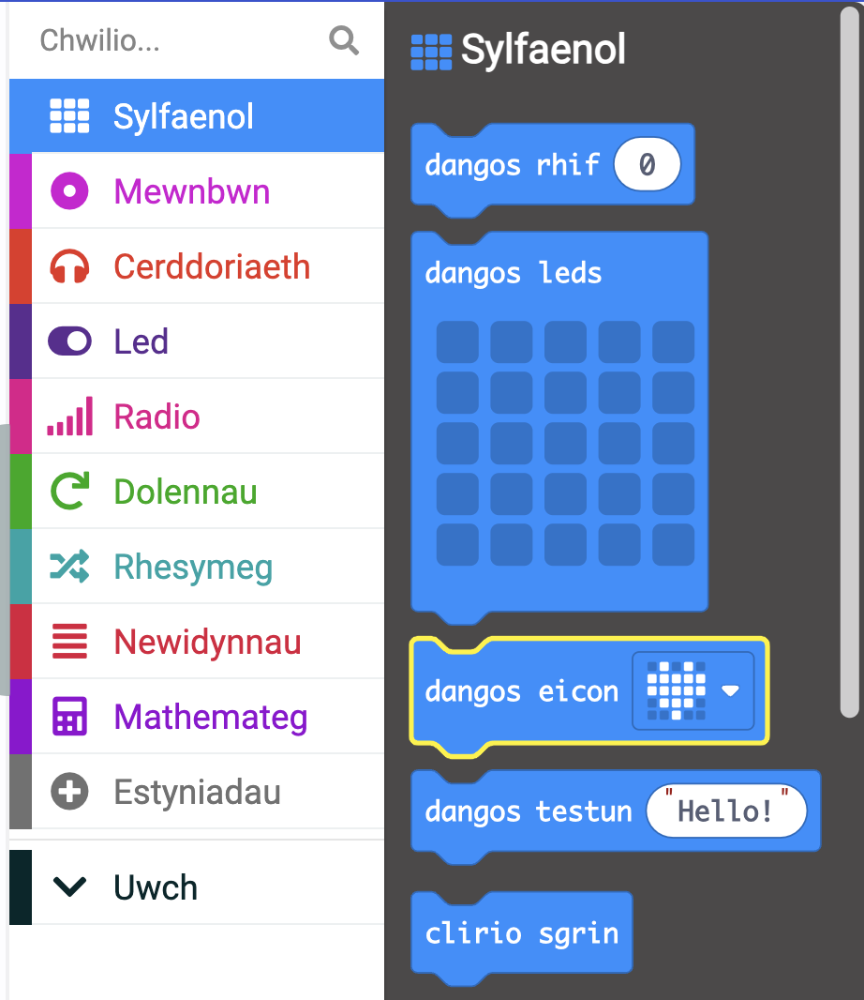
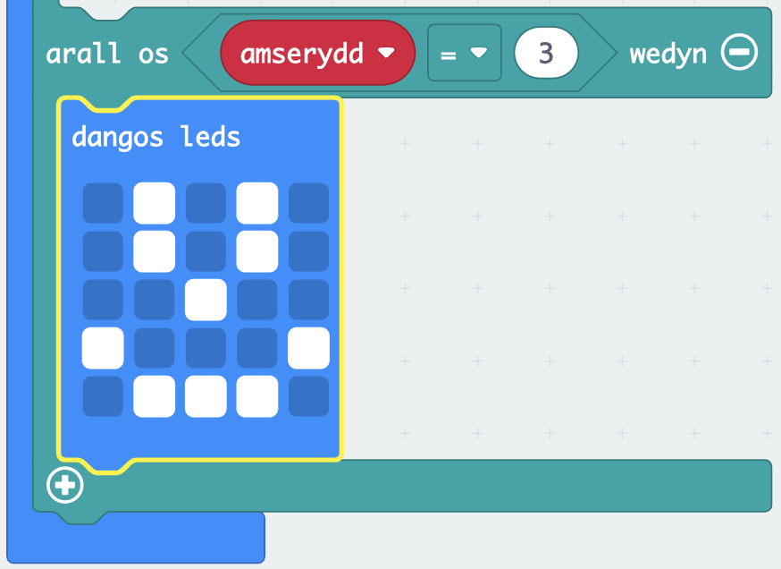

Mae'r **micro:bit** yn gyfrifiadur bach y gallwch ei ddefnyddio i ryngweithio â'r byd o'ch cwmpas.

Bydd y prosiect hwn yn eich helpu **ddarganfod** beth gall y **micro:bit** ei wneud.

### Beth fyddwch chi'n ei wneud

Ydych chi byth yn canfod eich hun yn meddwl pa weithgaredd i'w wneud nesaf? Gallwch ddefnyddio'r micro:bit i'ch helpu i benderfynu!

Yn y prosiect hwn, byddwch yn gwneud **dewisydd hobi ar hap**.

Byddwch yn:
+ Gwnewch i'r micro:bit oleuo ac arddangos delweddau
+ Defnyddiwch haprifau i wneud dewisiadau
+ Defnyddiwch flociau `os yw`{:class='microbitlogic'} i reoli pa ddelweddau sy'n cael eu harddangos
+ Defnyddiwch y logo neu fotwm i glirio'r arddangosfa

--- no-print ---

### Chwarae ▶️

--- task ---

Beth sy'n digwydd os **ysgwyd** y micro:bit? Beth sy'n digwydd os cliciwch y logo ****?

<div style="position:relative;height:100%;padding-bottom:125%;padding-top:0;overflow:hidden;">
<iframe style="position:absolute;top:0;left:0;width:100%;height:100%;" src="https://makecode.microbit.org/---run?id=S47133-08356-20146-01355" allowfullscreen="allowfullscreen" sandbox="allow-popups allow-forms allow-scripts allow-same-origin" frameborder="0"></iframe>
</div>

--- /task ---

--- /no-print ---

### Agor MakeCode

I ddechrau creu eich prosiect micro:bit, mae angen ichi agor golygydd MakeCode.

--- task ---

Agorwch y golygydd MakeCode yn [makecode.microbit.org](https://makecode.microbit.org)

--- collapse ---

---
title: Fersiwn all-lein o'r golygydd
---

Mae yna hefyd [fersiwn y gellir ei lawrlwytho o olygydd MakeCode](https://makecode.microbit.org/offline-app).

--- /collapse ---

--- /task ---

Unwaith y bydd y golygydd ar agor, bydd angen i chi greu prosiect newydd a rhoi enw i'ch prosiect.

--- task ---

Cliciwch ar y botwm **Prosiect Newydd**.


--- /task ---

--- task ---

Rhowch yr enw `Hobby selector` i'ch prosiect newydd a chliciwch **Creu**.


**Awgrym:** Er mwyn ei gwneud hi'n haws dod o hyd i'ch prosiect yn nes ymlaen, rhowch enw defnyddiol iddo sy'n ymwneud â'r gweithgaredd rydych chi'n ei greu.

--- /task ---

### Golygydd MakeCode

Wedi'i greu gan y micro:bit Foundation, mae gan **olygydd MakeCode** bopeth sydd ei angen arnoch i ddechrau codio ar micro:bit.


Ar yr ochr chwith, mae **efelychydd**. Mae hwn yn cynnwys micro:bit rhithiol y gallwch ei ddefnyddio i brofi'ch cod!

Mae ganddo'r holl nodweddion a botymau a geir ar ficro:bit V2, gan gynnwys:
+ Arddangosfa LED
+ Llefarydd
+ Meicroffon
+ Botymau mewnbwn
    + A
    + B
    + Logo

Yn y canol, mae **panel bloc**, sydd â chod lliw ac sy'n eich galluogi i gael mynediad at y blociau cod amrywiol.

Ar yr ochr dde, mae **panel golygydd cod**, lle rydych chi'n llusgo a gollwng blociau i greu eich rhaglen.

Mae panel golygydd MakeCode eisoes yn cynnwys dau floc: `ar gychwyn`{:class='microbitbasic'} ac `am byth`{:class='microbitbasic'}.

### Dangos eicon

Byddwch yn defnyddio'r bloc `am byth`{:class='microbitbasic'} i weld sut mae'r LEDs ar yr efelychydd yn gweithio.

--- task ---

Cliciwch ar y ddewislen bloc `Sylfaenol`{:class='microbitbasic'} yn y panel blociau. Bydd hyn yn ehangu i ddangos y blociau sydd ar gael i chi.



Llusgwch yr bloc `dangos eicon`{:class='microbitbasic'} a'i ollwng **y tu mewn i**'r bloc `am byth`{:class='microbitbasic'}. Dylai hwn ffitio yn ei le fel darn pos.

```microbit
basic.forever(function () {
    basic.showIcon(IconNames.Heart)
})
```

--- /task ---

--- task ---

Cliciwch ar y saeth i lawr ar y bloc dangos eicon a dewis eicon.


--- /task ---

--- task ---

**Prawf:** Cliciwch y botwm chwarae ar yr efelychydd. Dylai'r arddangosfa LED oleuo, gan ddangos yr eicon a ddewiswyd gennych.

Yn yr enghraifft hon, rydyn ni wedi dewis yr eicon `X`.


Da iawn! Rydych chi wedi gwneud y micro:bit i wneud rhywbeth!

--- /task ---

### Dewiswch eich hobïau

--- task ---

Dewiswch dri hobi neu weithgaredd yr ydych yn hoffi eu gwneud yn eich amser hamdden.

Dyma rai syniadau i'ch rhoi ar ben ffordd:
+ 🎮 Hapchwarae
+ 📚 Darllen
+ 🧁 Pobi
+ 📺 Gwylio teledu
+ 🚶‍♀️ Mynd am dro
+ 🏐 Chwaraeon
+ 🎨 Arlunio

--- /task ---

--- task ---

Newidiwch eich eicon i un sy'n cynrychioli eich hobi cyntaf.

Dewison ni ysbryd Pac-Man i gynrychioli hapchwarae! 👻

--- /task ---

### Creu newidyn

Byddwch yn defnyddio tri eicon gwahanol i gynrychioli tri hobi gwahanol.

Bydd pob hobi yn gysylltiedig â rhif a byddwch yn creu newidyn er mwyn i chi allu newid pa hobi sy'n cael ei arddangos.

--- task ---

Agorwch y ddewislen `Newidynnau`{:class='microbitvariables'}, a chliciwch **Gwneud newidyn**.


--- /task ---

--- task ---

Enwch y newidyn newydd `amserydd`, yna cliciwch ar y botwm **OK**.


--- /task ---

Fe welwch nawr fod blociau newydd ar gael. Mae'r blociau hyn yn gadael i chi osod, newid, neu ddefnyddio'r gwerth sydd wedi'i storio yn y newidyn `gweithgaredd`{:class='microbitvariables'}.


--- task ---

Llusgwch y bloc `gosod`{:class='microbitvariables'} y tu mewn i'r bloc `ar gychwyn`{:class='microbitbasic'}.

```microbit
let activity = 0
```

--- /task ---

### Pa hobi fydd yn arddangos?

Pan fydd `gweithgaredd`{ :class = 'microbitvariables'} wedi'i osod i `1`, dylai'r eicon ar gyfer eich hobi cyntaf ddangos. Pan fydd `gweithgaredd`{ :class = 'microbitvariables'} wedi'i osod i `2`, dylai'r eicon ar gyfer yr hobi nesaf ddangos.

Byddwch yn defnyddio blociau `os... yna` i wneud hyn.

--- task ---

Agorwch y ddewislen `Rhesymeg`{:class='microbitlogic'} a dewiswch y bloc `os`{:class='microbitlogic'}.


Llusgwch y bloc `os`{:class='microbitlogic'} y tu mewn i'r bloc dolen `am byth`{:class='microbitbasic'}. Rhowch ef **uwchben** eich bloc `dangos eicon`{:class='microbitbasic'}.

```microbit
basic.forever(function () {
    if (true) {

    }
    basic.showIcon(IconNames.Ghost)
})
```

--- /task ---

--- task ---

O'r ddewislen `Rhesymeg`{:class='microbitlogic'}, llusgwch allan y bloc cymharu `0 = 0`{:class='microbitlogic'}.


Rhowch ef y tu mewn i'r bwlch `gwir` o fewn y bloc `os`{:class='microbitlogic'}.

```microbit
basic.forever(function () {
    if (0 == 0) {

    }
    basic.showIcon(IconNames.Ghost)
})
```

--- /task ---

--- task ---

Ewch yn ôl i'r ddewislen `Newidynnau`{:class='microbitvariables'} a dewiswch y bloc bach sy'n dweud `gweithgaredd`{:class='microbitvariables'}.

Llusgwch y bloc hwn i'r `0` **cyntaf** yn eich bloc cymharu newydd.

Newidiwch yr ail `0` i `1`.

```microbit
basic.forever(function () {
    let activity = 0
    if (activity == 1) {

    }
    basic.showIcon(IconNames.Ghost)
})
```

--- /task ---

--- task ---

Llusgwch eich bloc `dangos eicon`{:class='microbitbasic'} **y tu mewn i**'r bloc `os`{:class='microbitlogic'}.

```microbit
basic.forever(function () {
    let activity = 0
    if (activity == 1) {
        basic.showIcon(IconNames.Ghost)
    }
})
```

--- /task ---

--- task ---

**Profwch** eich rhaglen:

Pan fyddwch chi'n gwneud newidiad i floc côd, bydd yr efelychydd yn ailgychwyn.

Efallai eich bod wedi sylwi na ymddangosodd unrhyw beth ar y LEDs ar ôl eich newidiad diwethaf.

Dewch o hyd i'ch bloc `gosod`{:class='microbitvariables'} eto. Awgrym: mae y tu mewn i'r bloc `ar gychwyn`{:class='microbitbasic'}.

**Newid** y `0` i `1`.

**Ail-brawf**:

Pan fydd yr efelychydd yn ailgychwyn ar ôl eich newid diwethaf, dylai'r eicon ymddangos.

Gwnewch yn siŵr eich bod **yn gosod gwerth y newidyn gweithgaredd yn ôl i `0`** yn barod ar gyfer y cam nesaf.

--- /task ---

### Ychwanegu mwy o hobïau

I ychwanegu mwy o opsiynau hobi at eich rhaglen, bydd angen i chi ychwanegu mwy o amodau at eich bloc `os`{:class='microbitlogic'}.

--- task ---

Cliciwch ar y symbol `+` ar waelod y bloc `os`. Bydd hyn yn creu bloc `arall`.


--- /task ---

--- task ---

Cliciwch ar y symbol `+` o dan yr `arall`{:class='microbitlogic'}. Bydd hyn yn creu `arall os`{:class='microbitlogic'}. Gwnewch hyn unwaith eto fel bod gennych ddau floc `arall os`{:class='microbitlogic'}.

--- /task ---

--- task ---

Nawr cliciwch ar y symbol `-` wrth ymyl yr `arall`{:class='microbitlogic'} i'w dynnu.


--- /task ---

--- task ---

Dde-gliciwch ar y bloc cyfan `=`{:class='microbitlogic'} yn y bloc `os`{:class='microbitlogic'} cyntaf.

Cliciwch ychydig i'r chwith o'r newidyn gweithgaredd, neu dim ond i'r dde o'r gwerth `0`, i wneud yn siŵr eich bod yn dewis y bloc cyfan.

Cliciwch **Dyblyg** i wneud copi.

Llusgwch y bloc dyblyg `=`{:class='microbitlogic'} i'r bloc `arall os`{:class='microbitlogic'} cyntaf. Yna newidiwch y rhif `1` i `2`.


--- /task ---

--- task ---

Dyblygwch y bloc `=`{:class='microbitlogic'} unwaith eto a llusgwch ef i'r ail floc `arall os`{:class='microbitlogic'}. Yna newidiwch y rhif i `3`.

```microbit
basic.forever(function () {
    let activity = 0
    if (activity == 1) {
        basic.showIcon(IconNames.Ghost)
    } else if (activity == 2) {

    } else if (activity == 3) {

    }
})
```

--- /task ---

### Steiliwch eich hobïau

--- task ---

**Dewiswch** ddwy ddelwedd arall i gynrychioli eich hobïau.

Gallwch ddefnyddio'r bloc `dangos eicon`{:class='microbitbasic'} neu greu eich eicon eich hun gan ddefnyddio'r bloc `dangos LEDs`{:class='microbitbasic'}.

--- collapse ---

---
teitl: Defnyddio'r bloc dangos leds
---

O'r ddewislen `Sylfaenol`{:class='microbitbasic'}, llusgwch y bloc `dangos LEDs`{:class='microbitbasic'} y tu mewn i floc `arall os`{:class='microbitlogic'}.


Gallwch glicio ar bob un o'r sgwariau i ddewis pa rai rydych chi am eu goleuo. Bydd sgwariau gwyn yn cael eu goleuo ar y micro:bit.



--- /collapse ---

--- /task ---

### Dewiswch hobi ar hap

**Gosodwch** y micro:bit i ddewis hobi ar hap pan fyddwch chi'n ei ysgwyd.

--- task ---

Llusgwch y bloc `ar ysgwyd`{:class='microbitinput'} o'r ddewislen `Mewnbwn`{:class='microbitinput'}.


--- /task ---

--- task ---

O'r ddewislen `Newidynnau`{:class='microbitvariables'}, llusgwch y bloc `gosod`{:class='microbitvariables'} y tu mewn i'r bloc `ar ysgwyd`{:class='microbitinput'}.

--- /task ---

--- task ---

O'r ddewislen `Mathemateg`{:class='microbitmath'}, llusgwch y bloc `dewis hap`{:class='microbitmath'} i'r `0` o'r bloc `gosod`{:class='microbitmath'}.


Newidiwch y rhifau `0 i 10` i `1 i 3`.

```microbit
let activity = 0
input.onGesture(Gesture.Shake, function () {
    activity = randint(1, 3)
})
```

--- /task ---

### Clirio'r arddangosfa

Defnyddiwch y logo cyffwrdd-sensitif (V2) neu fotwm (V1) i ddiffodd y LEDs.

--- task ---

Llusgwch y `ar wasgu'r logo`{:class='microbitinput'} o'r ddewislen `Mewnbwn`{:class='microbitinput'}.


--- collapse ---

---
teitl: V1 defnyddwyr micro:bit
---

Mae mewnbwn y logo ar gael ar y micro:bit V2 yn unig.

Ar gyfer y micro:bit V1, defnyddiwch y bloc `ar fotwm`{:class='microbitinput'} o'r ddewislen `Mewnbwn`{:class='microbitinput'}.


--- /collapse ---

--- /task ---

--- task ---

Llusgwch y bloc `clirio sgrîn`{:class='microbitbasic'} o'r ddewislen `Sylfaenol`{:class='microbitbasic'} a'i osod y tu mewn i'r bloc`ar gwasgu'r logo`{:class='microbitinput'} (neu y bloc `ar fotwm`{:class='microbitinput'} ar gyfer V1).

```microbit
input.onLogoEvent(TouchButtonEvent.Pressed, function () {
    basic.clearScreen()
})
```

--- /task ---

--- task ---

Nawr llusgwch y bloc `gosod`{:class='microbitvariables'} o'r ddewislen `Newidynnau`{:class='microbitvariables'} a'i osod o dan y bloc `clirio sgrîn`{:class='microbitbasic'}.

```microbit
let activity = 0
input.onLogoEvent(TouchButtonEvent.Pressed, function () {
    basic.clearScreen()
    activity = 0
})
```

--- /task ---

--- task ---

**Profwch** eich rhaglen:

**Cliciwch** ar y botwm ysgwyd ar yr efelychydd i ddewis hobi ar hap.

**Defnyddiwch** y logo (neu Fotwm A ar y micro:bit V1) i sicrhau bod y sgrin yn clirio.

--- /task ---

--- task ---

Dadlwythwch eich côd a phrofwch ef ar micro:bit corfforol!

[[[download-to-microbit]]]

Pan fyddwch wedi lawrlwytho'ch rhaglen i'ch micro:bit, bydd yn rhedeg ar unwaith.

**Prawf**: Ddylech weld eicon ar hap bob tro y byddwch yn ysgwyd y micro:bit.

--- /task ---

[[[microbit-share]]]

### Prosiect wedi'i gwblhau

Os ydych am wirio'ch côd gallwch ddod o hyd i't [prosiect gorffenedig yma](https://makecode.microbit.org/S47133-08356-20146-01355){:target = "_blank"}.

### Uwchraddio eich prosiect

Gallwch chi uwchraddio'ch prosiect i'w wneud yn fwy deniadol:

+ Ychwanegwch fwy o hobïau fel bod gennych chi ystod ehangach i ddewis ohonynt.

Cofiwch:
  + Ychwanegu symbol gwahanol i'w ddangos ar gyfer pob gweithgaredd
  + Cynyddu'y nifer o flociau `arall os` er mwyn i chi allu ychwanegu mwy o eiconau
  + Cynyddwch yr ystod ar hap i fwy na thri i gyd-fynd â nifer y hobïau ychwanegol
