Το **micro:bit** είναι ένας μικρός υπολογιστής που μπορείς να χρησιμοποιήσεις για να αλληλεπιδράσεις με τον κόσμο γύρω σου.

Αυτό το έργο θα σε βοηθήσει να **ανακαλύψεις** τι μπορεί να κάνει το **micro:bit**.

### Τι θα κάνεις

Έχει συμβεί να αναρωτιέσαι τι δραστηριότητα να κάνεις στη συνέχεια; Μπορείς να χρησιμοποιήσεις το micro:bit για να αποφασίσεις!

Σε αυτό το έργο, θα δημιουργήσεις έναν τυχαίο επιλογέα χόμπι ****.

Θα:
+ Κάνεις το micro:bit να ανάψει και να εμφανίσει εικόνες
+ Χρησιμοποιήσεις τυχαίους αριθμούς για να κάνεις επιλογές
+ Χρησιμοποίησε το μπλοκ `εάν`{:class='microbitlogic'} για να ελέγξεις ποιες εικόνες εμφανίζονται
+ Χρησιμοποιήσεις το λογότυπο ή ένα κουμπί για να καθαρίσεις την οθόνη

--- no-print ---

### Δοκίμασέ το ▶️

--- task ---

Τι θα συμβεί αν **κουνήσεις** το micro:bit; Τι συμβαίνει εάν κάνεις κλικ στο λογότυπο ****;

<div style="position:relative;height:100%;padding-bottom:125%;padding-top:0;overflow:hidden;">
<iframe style="position:absolute;top:0;left:0;width:100%;height:100%;" src="https://makecode.microbit.org/---run?id=S47133-08356-20146-01355" allowfullscreen="allowfullscreen" sandbox="allow-popups allow-forms allow-scripts allow-same-origin" frameborder="0"></iframe>
</div>

--- /task ---

--- /no-print ---

### Άνοιξε το MakeCode

Για να ξεκινήσεις τη δημιουργία του έργου σου με το micro:bit, πρέπει να ανοίξεις το πρόγραμμα επεξεργασίας MakeCode.

--- task ---

Άνοιξε το πρόγραμμα επεξεργασίας MakeCode στη διεύθυνση [makecode.microbit.org](https://makecode.microbit.org)

--- collapse ---

---
title: Έκδοση εκτός σύνδεσης του επεξεργαστή
---

Υπάρχει επίσης μια έκδοση [με δυνατότητα λήψης του προγράμματος επεξεργασίας MakeCode](https://makecode.microbit.org/offline-app).

--- /collapse ---

--- /task ---

Μόλις ανοίξει το πρόγραμμα επεξεργασίας, θα χρειαστεί να δημιουργήσεις ένα νέο έργο και να δώσεις ένα όνομα στο έργο σου.

--- task ---

Κάνε κλικ στο κουμπί **Νέο έργο**.

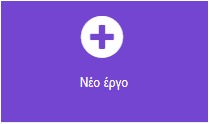

--- /task ---

--- task ---

Δώσε στο νέο σου έργο το όνομα `Επιλογέας χόμπι` και κάντε κλικ στο **Δημιουργία**.

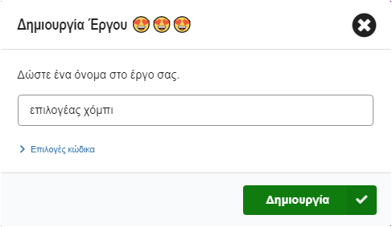

**Συμβουλή:** Για να γίνει πιο εύκολη η εύρεση του έργου σουαργότερα, δώσε του ένα όνομα που να σχετίζεται με τη δραστηριότητα που δημιουργείς.

--- /task ---

### Το πρόγραμμα επεξεργασίας MakeCode

Δημιουργημένο από το micro:bit Foundation, το πρόγραμμα επεξεργασίας **MakeCode** έχει όλα όσα χρειάζεσαι για να ξεκινήσετε να προγραμματίζεις στο micro:bit.

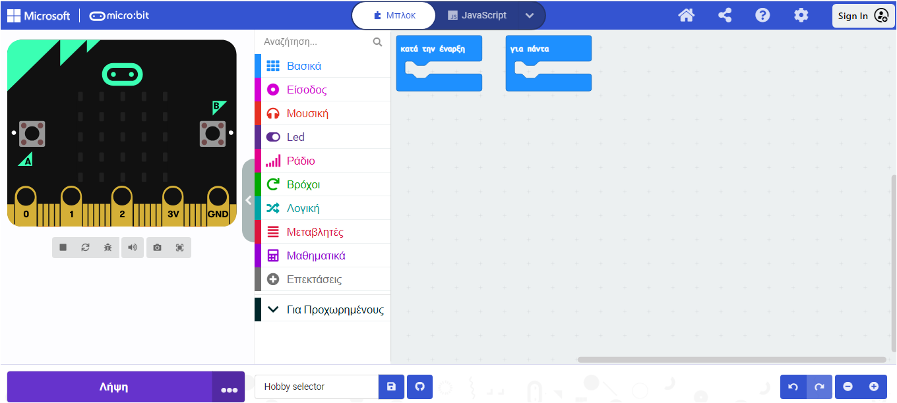

Στην αριστερή πλευρά, υπάρχει ένας **προσομοιωτής**. Αυτό περιέχει ένα εικονικό micro:bit που μπορείς να χρησιμοποιήσεις για να δοκιμάσεις τον κώδικά σου!

Διαθέτει όλα τα χαρακτηριστικά και τα κουμπιά που βρίσκονται σε ένα micro:bit V2, όπως:
+ Οθόνη LED
+ Ηχείο
+ Μικρόφωνο
+ Κουμπιά εισαγωγής
    + A
    + B
    + Λογότυπο

Στο κέντρο, υπάρχει ο **πίνακας με τα μπλοκ**, ο οποίος είναι χρωματικά κωδικοποιημένος και σου επιτρέπει να έχεις πρόσβαση στα διάφορα μπλοκ κώδικα.

Στη δεξιά πλευρά, υπάρχει ο **πίνακας του επεξεργαστή κώδικα**, όπου σύρεις και αφήνεις μπλοκ για να δημιουργήσεις το πρόγραμμά σου.

Το πρόγραμμα επεξεργασίας MakeCode περιέχει ήδη δύο μπλοκ: `κατά την έναρξη`{:class='microbitbasic'} και `για πάντα`{:class='microbitbasic'}.

### Εμφάνιση εικονιδίου

Θα χρησιμοποιήσεις το μπλοκ `για πάντα` για να δεις πώς λειτουργούν τα LED στον προσομοιωτή.

--- task ---

Κάνε κλικ στο μενού μπλοκ `Βασικά`{:class='microbitbasic'} στον πίνακα μπλοκ. Αυτό θα επεκταθεί για να σου δείξει τα διαθέσιμα μπλοκ.

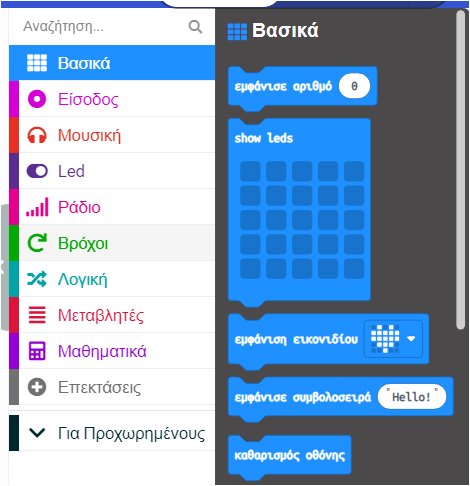

Σύρε το μπλοκ `εμφάνιση εικονιδίου`{:class='microbitbasic'} και απόθεσε το **μέσα** στο μπλοκ `για πάντα`{:class='microbitbasic'}. Θα πρέπει να ταιριάζει στη θέση του σαν ένα κομμάτι παζλ.

```microbit
basic.forever(function () {
    basic.showIcon(IconNames.Heart)
})
```

--- /task ---

--- task ---

Κάνε κλικ στο κάτω βέλος στο μπλοκ εικονιδίων εμφάνισης και επίλεξε ένα εικονίδιο.

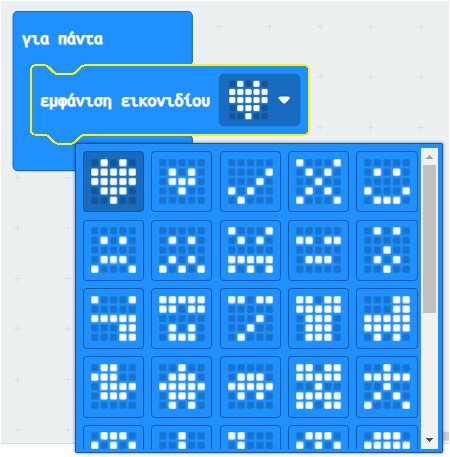


--- /task ---

--- task ---

**Δοκιμή:** Κάνε κλικ στο κουμπί έναρξη προσομοιωτή στον προσομοιωτή. Η οθόνη LED θα πρέπει να ανάψει, εμφανίζοντας το εικονίδιο που έχεις επιλέξει.

Σε αυτό το παράδειγμα, επιλέξαμε το εικονίδιο `X`.

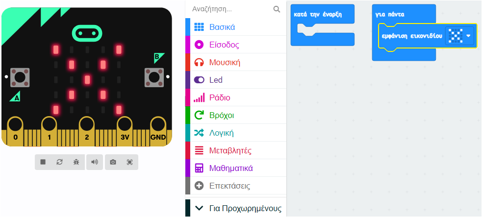

Μπράβο! Προγραμμάτισες το micro:bit να κάνει κάτι!

--- /task ---

### Επίλεξε τα χόμπι σου

--- task ---

Επίλεξε τρία χόμπι ή δραστηριότητες που σου αρέσει να κάνεις στον ελεύθερο χρόνο σου.

Εδώ είναι μερικές ιδέες για να ξεκινήσεις:
+ 🎮 Παιχνίδια στον υπολογιστή
+ 📚 Διάβασμα
+ 🧁 Ζαχαροπλαστική
+ 📺 Να βλέπεις τηλεόραση
+ 🚶‍♀️ Περίπατος
+ 🏐 Να κάνεις ένα άθλημα
+ 🎨 Να ζωγραφίζεις

--- /task ---

--- task ---

Άλλαξε το εικονίδιο σου σε ένα που να αντιπροσωπεύει το πρώτο σου χόμπι.

Επιλέξαμε ένα φάντασμα Pac-Man για να αναπαραστήσει το παιχνίδι στον υπολογιστή! 👻

--- /task ---

### Δημιούργησε μία μεταβλητή

Θα χρησιμοποιήσεις τρία διαφορετικά εικονίδια για να αναπαραστήσεις τρία διαφορετικά χόμπι.

Κάθε χόμπι θα συνδέεται με έναν αριθμό και θα δημιουργήσεις μια μεταβλητή έτσι ώστε να μπορείς να αλλάζεις το χόμπι που εμφανίζεται.

--- task ---

Άνοιξε το μενού `Μεταβλητές`{:class='block3variables'} και κάνε κλικ στο κουμπί **Δημιουργία μεταβλητής**.


--- /task ---

--- task ---

Ονόμασε τη νέα μεταβλητή `δραστηριότητα`και, στη συνέχεια, κάνε κλικ στο κουμπί **OK**.

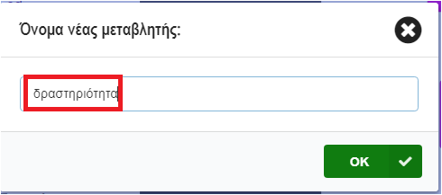

--- /task ---

Θα δεις τώρα ότι υπάρχουν διαθέσιμα νέα μπλοκ. Αυτά τα μπλοκ σου επιτρέπουν να ορίσεις, να αλλάξεις ή να χρησιμοποιήσεις την τιμή που είναι αποθηκευμένη στη μεταβλητή `δραστηριότητα`.

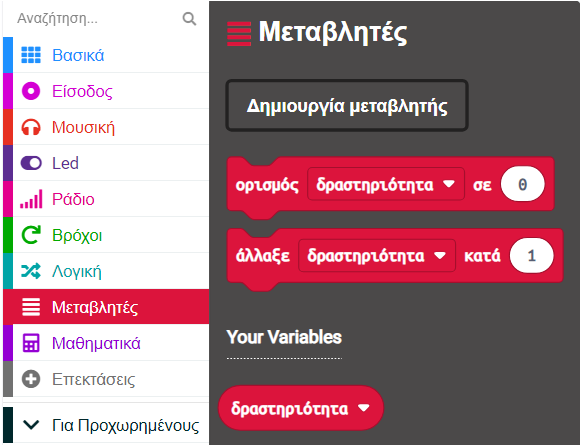

--- task ---

Σύρε το μπλοκ `ορισμός`{:class='microbitvariables'} μέσα στο μπλοκ `κατά την έναρξη`{:class='microbitbasic'}.

```microbit
let δραστηριότητα = 0
```

--- /task ---

### Ποιο χόμπι θα εμφανίσει;

Όταν η `δραστηριότητα` έχει οριστεί σε `1`, θα πρέπει να εμφανίζεται το εικονίδιο για το πρώτο σου χόμπι. Όταν η `δραστηριότητα` έχει οριστεί σε `2`, θα πρέπει να εμφανίζεται το εικονίδιο για το επόμενό σου χόμπι.

Θα χρησιμοποιήσεις μπλοκ `εάν... τότε` για να το κάνεις αυτό.

--- task ---

Άνοιξε το μενού `Λογική`{:class='microbitlogic'} και επίλεξε το μπλοκ `εάν`{:class='microbitlogic'}.

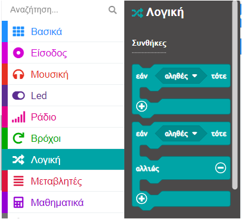

Σύρε το μπλοκ `εάν`{:class='microbitlogic'} μέσα στο μπλοκ βρόχου `για πάντα`{:class='microbitbasic'}. Τοποθέτησέ το **πάνω** από το μπλοκ `εμφάνιση εικονιδίου`{:class='microbitbasic'}.

```microbit
basic.forever(function () {
    if (true) {

    }
    basic.showIcon(IconNames.Ghost)
})
```

--- /task ---

--- task ---

Από το μενού `Λογική`{:class='microbitlogic'}, πάρε το μπλοκ σύγκρισης `0 = 0`{:class='microbitlogic'}.

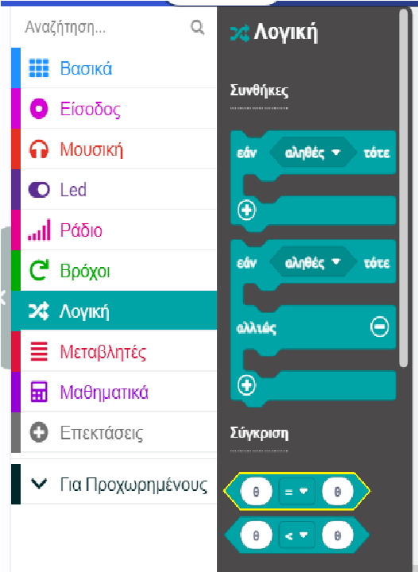

Τοποθέτησέ το μέσα στο διάστημα `αληθές` μέσα στο μπλοκ `εάν`{:class='microbitlogic'}.

```microbit
basic.forever(function () {
    if (0 == 0) {

    }
    basic.showIcon(IconNames.Ghost)
})
```

--- /task ---

--- task ---

Πήγαινε πίσω στο μενού `Μεταβλητές`{:class='microbitvariables'} και επίλεξε το μικρό μπλοκ που λέει `δραστηριότητα`{:class='microbitvariables'}.

Σύρε αυτό το μπλοκ στο **πρώτο** `0` στο νέο μπλοκ σύγκρισης.

Άλλαξε το δεύτερο `0` σε `1`.

```microbit
basic.forever(function () {
    let δραστηριότητα = 0
    if (δραστηριότητα == 1) {

    }
    basic.showIcon(IconNames.Ghost)
})
```

--- /task ---

--- task ---

Σύρε το μπλοκ `εμφάνιση εικονιδίου`{:class='microbitbasic'} **μέσα** στο μπλοκ `εάν`{:class='microbitlogic'}.

```microbit
basic.forever(function () {
    let δραστηριότητα = 0
    if (δραστηριότητα == 1) {
        basic.showIcon(IconNames.Ghost)
    }
})
```

--- /task ---

--- task ---

**Δοκίμασε** το πρόγραμμά σου:

Όταν κάνεις μια αλλαγή σε ένα μπλοκ κώδικα, ο προσομοιωτής θα επανεκκινήσει.

Ίσως έχεις παρατηρήσει ότι δεν εμφανίστηκε τίποτα στα LED μετά την τελευταία σου αλλαγή.

Βρες ξανά το μπλοκ `ορισμός`{:class='microbitvariables'}. Συμβουλή: βρίσκεται μέσα στο μπλοκ `κατά την έναρξη`{:class='microbitbasic'}.

**Άλλαξε** το `0` σε `1`.

**Δοκίμασε ξανά**:

Όταν ο προσομοιωτής επανεκκινήσει μετά την τελευταία σου αλλαγή, θα πρέπει να εμφανιστεί το εικονίδιο.

Βεβαιώσου ότι έχεις **ορίσει την τιμή της μεταβλητής δραστηριότητα στο `0`** για το επόμενο βήμα.

--- /task ---

### Πρόσθεσε περισσότερα χόμπι

Για να προσθέσεις περισσότερες επιλογές χόμπι στο πρόγραμμά σου, θα χρειαστεί να προσθέσεις περισσότερες συνθήκες στο μπλοκ `εάν`{:class='microbitlogic'}.

--- task ---

Κάνε κλικ στο σύμβολο `+` στο κάτω μέρος του μπλοκ `εάν`. Αυτό θα δημιουργήσει ένα μπλοκ `αλλιώς`.

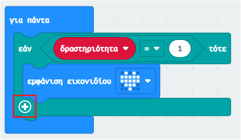

--- /task ---

--- task ---

Κάνε κλικ στο σύμβολο `+` κάτω από το `αλλιώς`{:class='microbitlogic'}. Αυτό θα δημιουργήσει ένα `αλλιώς εάν`{:class='microbitlogic'}. Κάντο άλλη μια φορά για να έχεις άλλα δύο μπλοκ `αλλιώς εάν`{:class='microbitlogic'}.

--- /task ---

--- task ---

Τώρα κάνε κλικ στο σύμβολο `-` δίπλα στο `αλλιώς`{:class='microbitlogic'} για να το αφαιρέσεις.

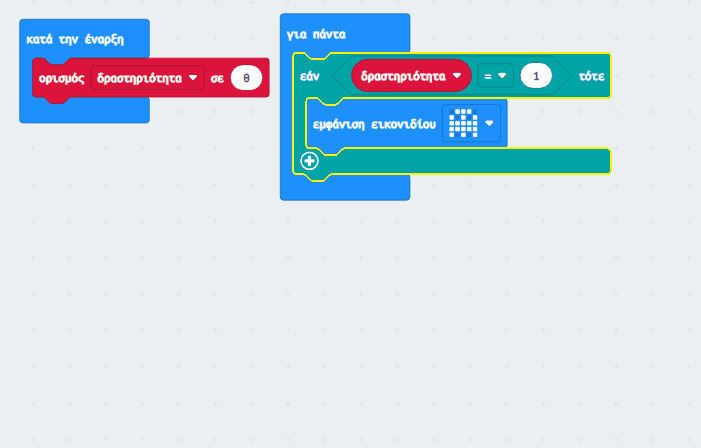

--- /task ---

--- task ---

Κάνε δεξί κλικ σε ολόκληρο το μπλοκ `=`{:class='microbitlogic'} στο πρώτο μπλοκ `εάν`{:class='microbitlogic'}.

Κάνε κλικ μόνο στα αριστερά της μεταβλητής δραστηριότητα, ή ακριβώς στα δεξιά της τιμής `0`, για να βεβαιωθείς ότι έχεις επιλέξει ολόκληρο το μπλοκ.

Κάνε κλικ στο **Αντίγραφο** για να δημιουργήσεις ένα αντίγραφο.

Σύρε το διπλότυπο μπλοκ `=`{:class='microbitlogic'} μέσα στο πρώτο μπλοκ `εάν`{:class='microbitlogic'}. Άλλαξε τον αριθμό `1` σε `2`.

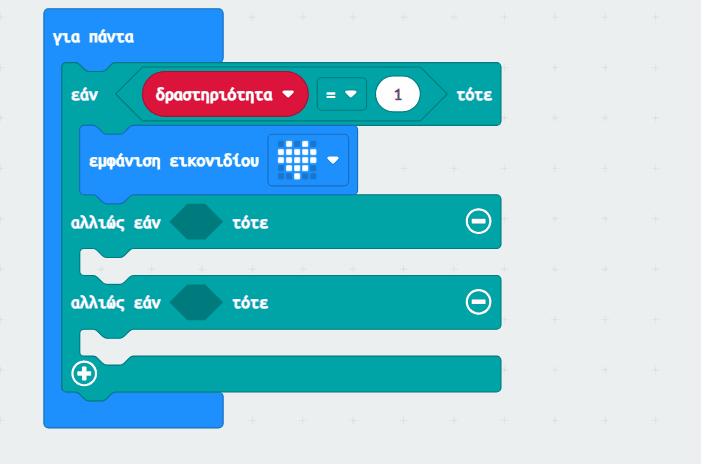

--- /task ---

--- task ---

Αντίγραψε το μπλοκ `=`{:class='microbitlogic'} άλλη μια φορά και σύρε το στο δεύτερο μπλοκ `εάν`{:class='microbitlogic'}. Άλλαξε τον αριθμό σε `3`.

```microbit
basic.forever(function () {
    let δραστηριότητα = 0
    if (δραστηριότητα == 1) {
        basic.showIcon(IconNames.Ghost)
    } else if (δραστηριότητα == 2) {

    } else if (δραστηριότητα == 3) {

    }
})
```

--- /task ---

### Δώσε στυλ στα χόμπι σου

--- task ---

**Επιίλεξε** δύο ακόμα εικόνες για να συμβολίζουν τα χόμπι σου.

Μπορείς να χρησιμοποιήσεις το μπλοκ `εμφάνιση εικονιδίου`{:class='microbitbasic'} ή να δημιουργήσεις το δικό σου εικονίδιο χρησιμοποιώντας το μπλοκ `show led`{:class='microbitbasic'}.

--- collapse ---

---
title: Χρησιμοποιώντας το μπλοκ show leds
---

Από το μενού `Βασικά`{:class='microbitbasic'}, σύρε το μπλοκ `show led`{:class='microbitbasic'} μέσα σε ένα μπλοκ `αλλιώς εάν`{:class='microbitlogic'}.

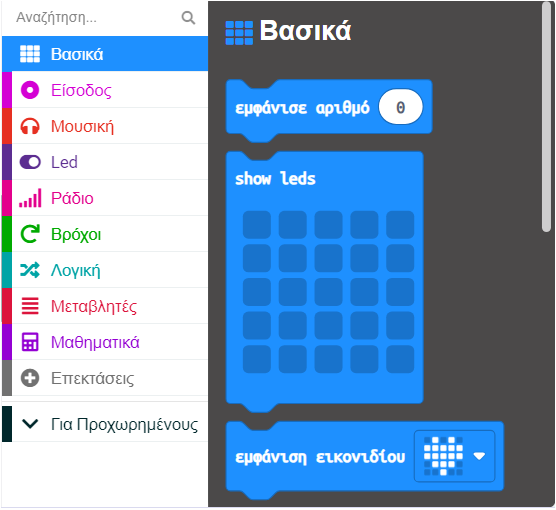

Μπορείς να κάνεις κλικ σε καθένα από τα τετράγωνα για να επιλέξεις ποια θέλεις να ανάψεις. Τα λευκά τετράγωνα θα είναι αναμμένα στο micro:bit.

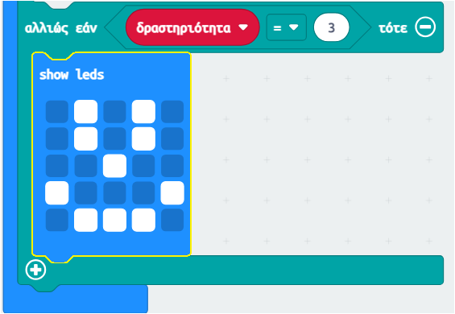

--- /collapse ---

--- /task ---

### Επίλεξε ένα τυχαίο χόμπι

**Όρισε** το micro:bit να επιλέγει ένα τυχαίο χόμπι όταν το κουνάς.

--- task ---

Σύρε το μπλοκ `στο κούνημα`{:class='microbitinput'} από το μενού `Είσοδος`{:class='microbitinput'}.

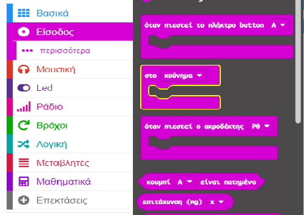

--- /task ---

--- task ---

Από το μενού `Μεταβλητές`{:class='microbitvariables'}, σύρε το μπλοκ `ορισμός`{:class='microbitvariables'} μέσα στο μπλοκ `στο κούνημα`{:class='microbitinput'}.

--- /task ---

--- task ---

Από το μενού `Μαθηματικά`{:class='microbitmath'}, σύρε το μπλοκ `τυχαία επιλογή`{:class='microbitmath'} στο `0` του μπλοκ `ορισμός`{:class='microbitvariables'}.

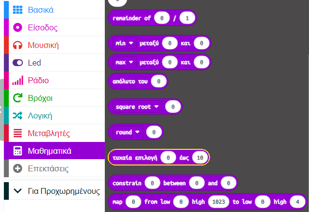

Άλλαξε τους αριθμούς `0 έως 10` σε `1 έως 3`.

```microbit
let δραστηριότητα = 0
input.onGesture(Gesture.Shake, function () {
    δραστηριότητα = randint(1, 3)
})
```

--- /task ---

### Καθάρισε την οθόνη

Χρησιμοποίησε το σημείο αφής στο λογότυπο (V2) ή ένα κουμπί (V1) για να σβήσεις τα LED.

--- task ---

Σύρε το μπλοκ `on logo pressed`{:class='microbitinput'} από το μενού `Είσοδος`{:class='microbitinput'}.

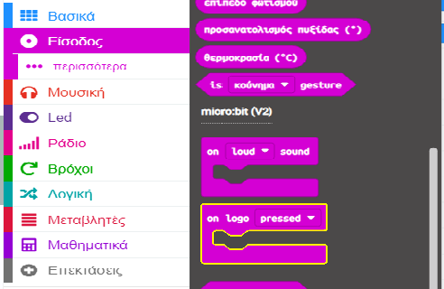

--- collapse ---

---
title: Χρήστες του micro:bit V1
---

Η είσοδος λογότυπου είναι διαθέσιμη μόνο στο micro:bit V2.

Για το V1 micro:bit, χρησιμοποίησε το μπλοκ `όταν πιεστεί το πλήκτρο button`{:class='microbitinput'} από το μενού `Είσοδος`{:class='microbitinput'}.

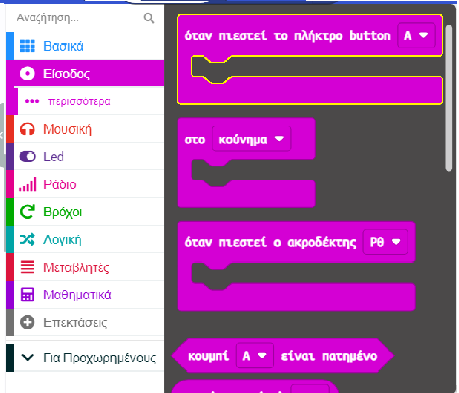

--- /collapse ---

--- /task ---

--- task ---

Σύρε το μπλοκ `καθαρισμός οθόνης`{:class='microbitbasic'} από το μενού `Βασικά`{:class='microbitbasic'} και τοποθέτησέ το μέσα στο μπλοκ `on logo pressed`{:class='microbitinput'} (ή το μπλοκ `όταν πιεστεί το πλήκτρο button`{:class='microbitinput'} για το V1).

```microbit
input.onLogoEvent(TouchButtonEvent.Pressed, function () {
    basic.clearScreen()
})
```

--- /task ---

--- task ---

Τώρα σύρε το μπλοκ `ορισμός`{:class='microbitvariables'} από το μενού `Μεταβλητές`{:class='microbitvariables'} και τοποθέτησέ το κάτω από το μπλοκ `καθαρισμός οθόνης`{:class='microbitbasic'}.

```microbit
let δραστηριότητα = 0
input.onLogoEvent(TouchButtonEvent.Pressed, function () {
    basic.clearScreen()
    δραστηριότητα = 0
})
```

--- /task ---

--- task ---

**Δοκίμασε** το πρόγραμμά σου:

**Κάνε κλικ** στο κουμπί ανακίνησης στον προσομοιωτή για να επιλέξεις τυχαία ένα χόμπι.

**Χρησιμοποίησε** το λογότυπο (ή το κουμπί Button A στο micro:bit V1) για να βεβαιωθείς ότι η οθόνη καθαρίζει.

--- /task ---

--- task ---

Κατέβασε τον κώδικά σου και έλεγξέ τον σε ένα φυσικό micro:bit!

[[[download-to-microbit]]]

Όταν κατεβάσεις το πρόγραμμά σου στο micro:bit, θα εκτελεστεί αμέσως.

**Δοκιμή**: Θα πρέπει να βλέπεις ένα τυχαίο εικονίδιο κάθε φορά που ανακινείς το micro:bit.

--- /task ---

[[[microbit-share]]]

### Ολοκληρωμένο έργο

If you want to check your code you can can find [the completed project here](https://makecode.microbit.org/S47133-08356-20146-01355){:target="_blank"}.

### Αναβάθμισε το έργο σου

Μπορείς να αναβαθμίσεις το έργο σου για να το κάνεις πιο ελκυστικό:

+ Πρόσθεσε περισσότερα χόμπι, ώστε να έχεις ένα ευρύτερο φάσμα επιλογών.

Θυμήσου να:
  + Προσθέσεις ένα διαφορετικό σύμβολο για την εμφάνιση κάθε δραστηριότητας
  + Αυξήσεις τον αριθμό των μπλοκ `αλλιώς εαν`, ώστε να μπορείς να προσθέσεις περισσότερα εικονίδια
  + Αυξήσεις το εύρος των τυχαίων αριθμών σε περισσότερα από τρία για να ταιριάζει με τον αριθμό των χόμπι που πρόσθεσες
