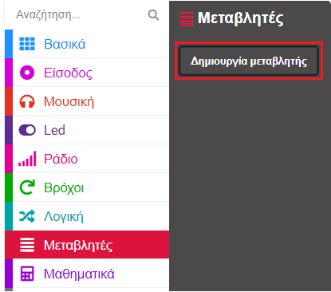

Το **micro:bit** είναι ένας μικρός υπολογιστής που μπορείς να χρησιμοποιήσεις για να αλληλεπιδράσεις με τον κόσμο γύρω σου.

Αυτό το έργο θα σε βοηθήσει να **ανακαλύψεις** τι μπορεί να κάνει το **micro:bit**.

### Τι θα κάνεις

Έχει συμβεί να αναρωτιέσαι τι δραστηριότητα να κάνεις στη συνέχεια; Μπορείς να χρησιμοποιήσεις το micro:bit για να αποφασίσεις!

Σε αυτό το έργο, θα δημιουργήσεις έναν τυχαίο επιλογέα χόμπι ****.

Θα:
+ Κάνεις το micro:bit να ανάψει και να εμφανίσει εικόνες
+ Χρησιμοποιήσεις τυχαίους αριθμούς για να κάνεις επιλογές
+ Use `if`{:class='microbitlogic'} blocks to control which images are displayed
+ Χρησιμοποιήσεις το λογότυπο ή ένα κουμπί για να καθαρίσεις την οθόνη

--- no-print ---

### Δοκίμασέ το ▶️

--- task ---

Τι θα συμβεί αν **κουνήσεις** το micro:bit; Τι συμβαίνει εάν κάνεις κλικ στο λογότυπο ****;

<div style="position:relative;height:100%;padding-bottom:125%;padding-top:0;overflow:hidden;">
<iframe style="position:absolute;top:0;left:0;width:100%;height:100%;" src="https://makecode.microbit.org/---run?id=S47133-08356-20146-01355" allowfullscreen="allowfullscreen" sandbox="allow-popups allow-forms allow-scripts allow-same-origin" frameborder="0"></iframe>
</div>

--- /task ---

--- /no-print ---

### Άνοιξε το MakeCode

Για να ξεκινήσεις τη δημιουργία του έργου σου με το micro:bit, πρέπει να ανοίξεις το πρόγραμμα επεξεργασίας MakeCode.

--- task ---

Άνοιξε το πρόγραμμα επεξεργασίας MakeCode στη διεύθυνση [makecode.microbit.org](https://makecode.microbit.org)

--- collapse ---

---
title: Έκδοση εκτός σύνδεσης του επεξεργαστή
---

Υπάρχει επίσης μια έκδοση [με δυνατότητα λήψης του προγράμματος επεξεργασίας MakeCode](https://makecode.microbit.org/offline-app).

--- /collapse ---

--- /task ---

Μόλις ανοίξει το πρόγραμμα επεξεργασίας, θα χρειαστεί να δημιουργήσεις ένα νέο έργο και να δώσεις ένα όνομα στο έργο σου.

--- task ---

Κάνε κλικ στο κουμπί **Νέο έργο**.


--- /task ---

--- task ---

Δώσε στο νέο σου έργο το όνομα `Επιλογέας χόμπι` και κάντε κλικ στο **Δημιουργία**.


**Συμβουλή:** Για να γίνει πιο εύκολη η εύρεση του έργου σουαργότερα, δώσε του ένα όνομα που να σχετίζεται με τη δραστηριότητα που δημιουργείς.

--- /task ---

### Το πρόγραμμα επεξεργασίας MakeCode

Δημιουργημένο από το micro:bit Foundation, το πρόγραμμα επεξεργασίας **MakeCode** έχει όλα όσα χρειάζεσαι για να ξεκινήσετε να προγραμματίζεις στο micro:bit.


Στην αριστερή πλευρά, υπάρχει ένας **προσομοιωτής**. Αυτό περιέχει ένα εικονικό micro:bit που μπορείς να χρησιμοποιήσεις για να δοκιμάσεις τον κώδικά σου!

Διαθέτει όλα τα χαρακτηριστικά και τα κουμπιά που βρίσκονται σε ένα micro:bit V2, όπως:
+ Οθόνη LED
+ Ηχείο
+ Μικρόφωνο
+ Κουμπιά εισαγωγής
    + A
    + B
    + Λογότυπο

Στο κέντρο, υπάρχει ο **πίνακας με τα μπλοκ**, ο οποίος είναι χρωματικά κωδικοποιημένος και σου επιτρέπει να έχεις πρόσβαση στα διάφορα μπλοκ κώδικα.

Στη δεξιά πλευρά, υπάρχει ο **πίνακας του επεξεργαστή κώδικα**, όπου σύρεις και αφήνεις μπλοκ για να δημιουργήσεις το πρόγραμμά σου.

The MakeCode editor panel already contains two blocks: `on start`{:class='microbitbasic'} and `forever`{:class='microbitbasic'}.

### Εμφάνιση εικονιδίου

You will use the `forever`{:class='microbitbasic'} block to see how the LEDs on the simulator work.

--- task ---

Click on the `Basic`{:class='microbitbasic'} block menu in the blocks panel. Αυτό θα επεκταθεί για να σου δείξει τα διαθέσιμα μπλοκ.


Drag the `show icon`{:class='microbitbasic'} block and drop it **inside** the `forever`{:class='microbitbasic'} block. Θα πρέπει να ταιριάζει στη θέση του σαν ένα κομμάτι παζλ.

```microbit
basic.forever(function () {
    basic.showIcon(IconNames.Heart)
})
```

--- /task ---

--- task ---

Κάνε κλικ στο κάτω βέλος στο μπλοκ εικονιδίων εμφάνισης και επίλεξε ένα εικονίδιο.


--- /task ---

--- task ---

**Δοκιμή:** Κάνε κλικ στο κουμπί έναρξη προσομοιωτή στον προσομοιωτή. Η οθόνη LED θα πρέπει να ανάψει, εμφανίζοντας το εικονίδιο που έχεις επιλέξει.

Σε αυτό το παράδειγμα, επιλέξαμε το εικονίδιο `X`.


Μπράβο! Προγραμμάτισες το micro:bit να κάνει κάτι!

--- /task ---

### Επίλεξε τα χόμπι σου

--- task ---

Επίλεξε τρία χόμπι ή δραστηριότητες που σου αρέσει να κάνεις στον ελεύθερο χρόνο σου.

Εδώ είναι μερικές ιδέες για να ξεκινήσεις:
+ 🎮 Παιχνίδια στον υπολογιστή
+ 📚 Διάβασμα
+ 🧁 Ζαχαροπλαστική
+ 📺 Να βλέπεις τηλεόραση
+ 🚶‍♀️ Περίπατος
+ 🏐 Να κάνεις ένα άθλημα
+ 🎨 Να ζωγραφίζεις

--- /task ---

--- task ---

Άλλαξε το εικονίδιο σου σε ένα που να αντιπροσωπεύει το πρώτο σου χόμπι.

Επιλέξαμε ένα φάντασμα Pac-Man για να αναπαραστήσει το παιχνίδι στον υπολογιστή! 👻

--- /task ---

### Δημιούργησε μία μεταβλητή

Θα χρησιμοποιήσεις τρία διαφορετικά εικονίδια για να αναπαραστήσεις τρία διαφορετικά χόμπι.

Κάθε χόμπι θα συνδέεται με έναν αριθμό και θα δημιουργήσεις μια μεταβλητή έτσι ώστε να μπορείς να αλλάζεις το χόμπι που εμφανίζεται.

--- task ---

Open the `Variables`{:class='microbitvariables'} menu, and click **Make a variable**.



--- /task ---

--- task ---

Ονόμασε τη νέα μεταβλητή `δραστηριότητα`και, στη συνέχεια, κάνε κλικ στο κουμπί **OK**.


--- /task ---

Θα δεις τώρα ότι υπάρχουν διαθέσιμα νέα μπλοκ. These blocks let you set, change, or use the value stored in the `activity`{:class='microbitvariables'} variable.


--- task ---

Drag the `set`{:class='microbitvariables'} block inside the `on start`{:class='microbitbasic'} block.

```microbit
let activity = 0
```

--- /task ---

### Ποιο χόμπι θα εμφανίσει;

When `activity`{:class='microbitvariables'} is set to `1`, the icon for your first hobby should display. When `activity`{:class='microbitvariables'} is set to `2`, the icon for the next hobby should display.

Θα χρησιμοποιήσεις μπλοκ `εάν... τότε` για να το κάνεις αυτό.

--- task ---

Open the `Logic`{:class='microbitlogic'} menu and choose the `if`{:class='microbitlogic'} block.


Drag the `if`{:class='microbitlogic'} block inside the `forever`{:class='microbitbasic'} loop block. Place it **above** your `show icon`{:class='microbitbasic'} block.

```microbit
basic.forever(function () {
    if (true) {

    }
    basic.showIcon(IconNames.Ghost)
})
```

--- /task ---

--- task ---

From the `Logic`{:class='microbitlogic'} menu, drag out the comparison block `0 = 0`{:class='microbitlogic'}.


Place it inside the `true` space within the `if`{:class='microbitlogic'} block.

```microbit
basic.forever(function () {
    if (0 == 0) {

    }
    basic.showIcon(IconNames.Ghost)
})
```

--- /task ---

--- task ---

Go back to the `Variables`{:class='microbitvariables'} menu and pick the small block that says `activity`{:class='microbitvariables'}.

Σύρε αυτό το μπλοκ στο **πρώτο** `0` στο νέο μπλοκ σύγκρισης.

Άλλαξε το δεύτερο `0` σε `1`.

```microbit
basic.forever(function () {
    let activity = 0
    if (activity == 1) {

    }
    basic.showIcon(IconNames.Ghost)
})
```

--- /task ---

--- task ---

Drag your `show icon`{:class='microbitbasic'} block **inside** the `if`{:class='microbitlogic'} block.

```microbit
basic.forever(function () {
    let activity = 0
    if (activity == 1) {
        basic.showIcon(IconNames.Ghost)
    }
})
```

--- /task ---

--- task ---

**Δοκίμασε** το πρόγραμμά σου:

Όταν κάνεις μια αλλαγή σε ένα μπλοκ κώδικα, ο προσομοιωτής θα επανεκκινήσει.

Ίσως έχεις παρατηρήσει ότι δεν εμφανίστηκε τίποτα στα LED μετά την τελευταία σου αλλαγή.

Find your `set`{:class='microbitvariables'} block again. Hint: it's inside the `on start`{:class='microbitbasic'} block.

**Άλλαξε** το `0` σε `1`.

**Δοκίμασε ξανά**:

Όταν ο προσομοιωτής επανεκκινήσει μετά την τελευταία σου αλλαγή, θα πρέπει να εμφανιστεί το εικονίδιο.

Βεβαιώσου ότι έχεις **ορίσει την τιμή της μεταβλητής δραστηριότητα στο `0`** για το επόμενο βήμα.

--- /task ---

### Πρόσθεσε περισσότερα χόμπι

To add more hobby options to your program, you will need to add more conditions to your `if`{:class='microbitlogic'} block.

--- task ---

Κάνε κλικ στο σύμβολο `+` στο κάτω μέρος του μπλοκ `εάν`. Αυτό θα δημιουργήσει ένα μπλοκ `αλλιώς`.


--- /task ---

--- task ---

Click on the `+` symbol below the `else`{:class='microbitlogic'}. This will create an `else if`{:class='microbitlogic'}. Do this one more time so you have two `else if`{:class='microbitlogic'} blocks.

--- /task ---

--- task ---

Now click on the `-` symbol next to the `else`{:class='microbitlogic'} to remove it.


--- /task ---

--- task ---

Right click on the whole `=`{:class='microbitlogic'} block in the first `if`{:class='microbitlogic'} block.

Κάνε κλικ μόνο στα αριστερά της μεταβλητής δραστηριότητα, ή ακριβώς στα δεξιά της τιμής `0`, για να βεβαιωθείς ότι έχεις επιλέξει ολόκληρο το μπλοκ.

Κάνε κλικ στο **Αντίγραφο** για να δημιουργήσεις ένα αντίγραφο.

Drag the duplicated `=`{:class='microbitlogic'} block into the first `else if`{:class='microbitlogic'} block. Άλλαξε τον αριθμό `1` σε `2`.


--- /task ---

--- task ---

Duplicate the `=`{:class='microbitlogic'} block one more time and drag it into the second `else if`{:class='microbitlogic'} block. Άλλαξε τον αριθμό σε `3`.

```microbit
basic.forever(function () {
    let activity = 0
    if (activity == 1) {
        basic.showIcon(IconNames.Ghost)
    } else if (activity == 2) {

    } else if (activity == 3) {

    }
})
```

--- /task ---

### Δώσε στυλ στα χόμπι σου

--- task ---

**Επιίλεξε** δύο ακόμα εικόνες για να συμβολίζουν τα χόμπι σου.

You can use the `show icon`{:class='microbitbasic'} block or create your own icon using the `show leds`{:class='microbitbasic'} block.

--- collapse ---

---
title: Χρησιμοποιώντας το μπλοκ show leds
---

From the `Basic`{:class='microbitbasic'} menu, drag the `show leds`{:class='microbitbasic'} block inside an `else if`{:class='microbitlogic'} block.


Μπορείς να κάνεις κλικ σε καθένα από τα τετράγωνα για να επιλέξεις ποια θέλεις να ανάψεις. Τα λευκά τετράγωνα θα είναι αναμμένα στο micro:bit.


--- /collapse ---

--- /task ---

### Επίλεξε ένα τυχαίο χόμπι

**Όρισε** το micro:bit να επιλέγει ένα τυχαίο χόμπι όταν το κουνάς.

--- task ---

Drag the `on shake`{:class='microbitinput'} block from the `Input`{:class='microbitinput'} menu.


--- /task ---

--- task ---

From the `Variables`{:class='microbitvariables'} menu, drag the `set`{:class='microbitvariables'} block inside the `on shake`{:class='microbitinput'} block.

--- /task ---

--- task ---

From the `Math`{:class='microbitmath'} menu, drag the `pick random`{:class='microbitmath'} block to the `0` of the `set`{:class='microbitvariables'} block.


Άλλαξε τους αριθμούς `0 έως 10` σε `1 έως 3`.

```microbit
let activity = 0
input.onGesture(Gesture.Shake, function () {
    activity = randint(1, 3)
})
```

--- /task ---

### Καθάρισε την οθόνη

Χρησιμοποίησε το σημείο αφής στο λογότυπο (V2) ή ένα κουμπί (V1) για να σβήσεις τα LED.

--- task ---

Drag the `on logo pressed`{:class='microbitinput'} block from the `Input`{:class='microbitinput'} menu.


--- collapse ---

---
title: Χρήστες του micro:bit V1
---

Η είσοδος λογότυπου είναι διαθέσιμη μόνο στο micro:bit V2.

For the V1 micro:bit, use the `on button`{:class='microbitinput'} block from the `Input`{:class='microbitinput'} menu.


--- /collapse ---

--- /task ---

--- task ---

Drag the `clear screen`{:class='microbitbasic'} block from the `Basic`{:class='microbitbasic'} menu and place it inside the `on logo pressed`{:class='microbitinput'} block (or the `on button`{:class='microbitinput'} block for V1).

```microbit
input.onLogoEvent(TouchButtonEvent.Pressed, function () {
    basic.clearScreen()
})
```

--- /task ---

--- task ---

Now drag the `set`{:class='microbitvariables'} block from the `Variables`{:class='microbitvariables'} menu and place it below the `clear screen`{:class='microbitbasic'} block.

```microbit
let activity = 0
input.onLogoEvent(TouchButtonEvent.Pressed, function () {
    basic.clearScreen()
    activity = 0
})
```

--- /task ---

--- task ---

**Δοκίμασε** το πρόγραμμά σου:

**Κάνε κλικ** στο κουμπί ανακίνησης στον προσομοιωτή για να επιλέξεις τυχαία ένα χόμπι.

**Χρησιμοποίησε** το λογότυπο (ή το κουμπί Button A στο micro:bit V1) για να βεβαιωθείς ότι η οθόνη καθαρίζει.

--- /task ---

--- task ---

Κατέβασε τον κώδικά σου και έλεγξέ τον σε ένα φυσικό micro:bit!

[[[download-to-microbit]]]

Όταν κατεβάσεις το πρόγραμμά σου στο micro:bit, θα εκτελεστεί αμέσως.

**Δοκιμή**: Θα πρέπει να βλέπεις ένα τυχαίο εικονίδιο κάθε φορά που ανακινείς το micro:bit.

--- /task ---

[[[microbit-share]]]

### Completed project

If you want to check your code you can can find [the completed project here](https://makecode.microbit.org/S47133-08356-20146-01355).

### Αναβάθμισε το έργο σου

Μπορείς να αναβαθμίσεις το έργο σου για να το κάνεις πιο ελκυστικό:

+ Πρόσθεσε περισσότερα χόμπι, ώστε να έχεις ένα ευρύτερο φάσμα επιλογών.

Θυμήσου να:
  + Προσθέσεις ένα διαφορετικό σύμβολο για την εμφάνιση κάθε δραστηριότητας
  + Αυξήσεις τον αριθμό των μπλοκ `αλλιώς εαν`, ώστε να μπορείς να προσθέσεις περισσότερα εικονίδια
  + Αυξήσεις το εύρος των τυχαίων αριθμών σε περισσότερα από τρία για να ταιριάζει με τον αριθμό των χόμπι που πρόσθεσες
