El **micro:bit** es una pequeña computadora que puedes usar para interactuar con el mundo que te rodea.

Este proyecto te ayudará a **descubrir** lo que puede hacer **micro:bit**.

### Lo que harás

¿Alguna vez te preguntas qué puedes hacer? ¡Puedes utilizar el micro:bit para ayudarte a decidir!

En este proyecto, crearás un **selector de pasatiempos aleatorio**.

Vas a:
+ Hacer encender la luz micro:bit y mostrar imágenes
+ Usar números aleatorios para hacer elecciones
+ Usar bloques `si`{:class='microbitlogic'} para controlar lo que se muestra
+ Usar el logo o un botón para borrar la pantalla

--- no-print ---

### Reproducir ▶️

--- task ---

¿Qué pasa si **sacudes** el micro:bit? ¿Qué sucede si haces clic en el **logo**?

<div style="position:relative;height:100%;padding-bottom:125%;padding-top:0;overflow:hidden;">
<iframe style="position:absolute;top:0;left:0;width:100%;height:100%;" src="https://makecode.microbit.org/---run?id=S47133-08356-20146-01355" allowfullscreen="allowfullscreen" sandbox="allow-popups allow-forms allow-scripts allow-same-origin" frameborder="0"></iframe>
</div>

--- /task ---

--- /no-print ---

### Abre MakeCode

Para empezar a crear tu proyecto micro:bit, necesitas abrir el editor MakeCode.

--- task ---

Abre el editor de MakeCode en [makecode.microbit.org](https://makecode.microbit.org)

--- collapse ---

---
title: Versión sin conexión del editor
---

También hay una versión [descargable del editor MakeCode](https://makecode.microbit.org/offline-app).

--- /collapse ---

--- /task ---

Una vez que el editor esté abierto, crea un nuevo proyecto y asígnale un nombre.

--- task ---

Haz clic en el botón **Nuevo proyecto**.

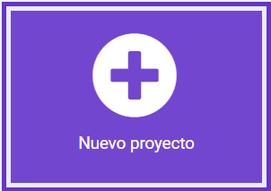

--- /task ---

--- task ---

Dale a tu nuevo proyecto el nombre `Selector de pasatiempos` y haz clic en **Crear**.

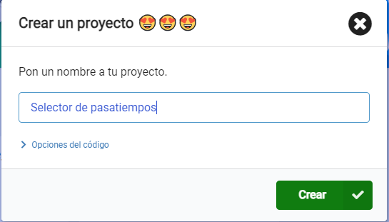

**Consejo:** Para que tu proyecto sea más fácil de encontrar más tarde, dale un nombre útil que se relacione con lo que estás creando.

--- /task ---

### El editor MakeCode

Creado por la Fundación micro:bit, el editor **de MakeCode** tiene todo lo que necesitas para empezar a programar el micro:bit.


En el lado izquierdo, hay un **simulador**. ¡Este es un micro:bit virtual que puedes usar para probar tu código!

Tiene todas las funciones y botones que se encuentran en un micro:bit V2, incluyendo:
+ Pantalla LED
+ Altavoz
+ Micrófono
+ Botones de entrada
    + A
    + B
    + Logo

En el centro se encuentra el panel de **bloques**, que está codificado por colores y permite acceder a varios bloques de código.

En el lado derecho, está el **panel del editor de código**, donde arrastras y sueltas bloques para crear tu programa.

El panel del editor MakeCode ya contiene dos bloques: `al iniciar`{:class='microbitbasic'} y `para siempre`{:class='microbitbasic'}.

### Mostrar icono

Utilizarás el bloque `para siempre`{:class='microbitbasic'} para ver cómo funcionan los LEDs en el simulador.

--- task ---

Haz clic en el menú de bloques `Básico`{:class='microbitbasic'} en el panel de bloques. Se expandirá para mostrarte los bloques disponibles.

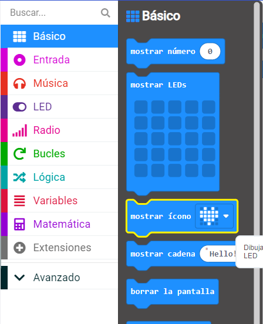

Arrastra el bloque `mostrar el icono`{:class='microbitbasic'} y colócalo **dentro** del bloque `al iniciar`{:class='microbitbasic'}. Debe encajar en su lugar como una pieza de rompecabezas.

```microbit
basic.forever(function () {
    basic.showIcon(IconNames.Heart)
})
```

--- /task ---

--- task ---

Haz clic en la flecha hacia abajo en el bloque mostrar el icono{: class='microbitbasic'} y elige un icono.

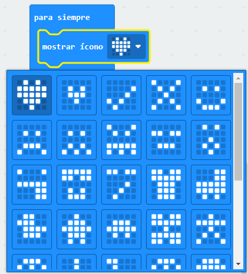


--- /task ---

--- task ---

**Prueba:** Haz clic en el botón Iniciar el simulador. La pantalla LED se debe encender, mostrando el icono elegido.

En este ejemplo, hemos elegido el icono `X`.

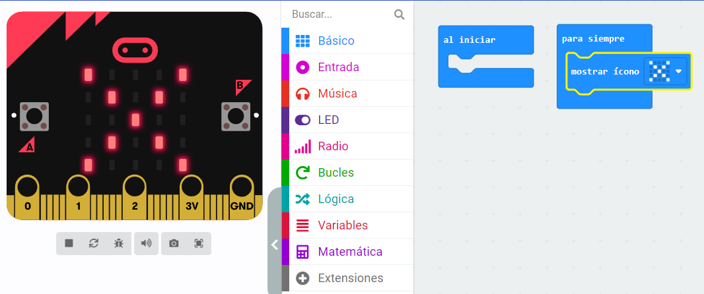

¡Bien hecho! ¡Has hecho que el micro:bit haga algo!

--- /task ---

### Elige tus pasatiempos

--- task ---

Elige tres pasatiempos o actividades que te gusten hacer en tu tiempo libre.

Aquí tienes algunas ideas para comenzar:
+ 🎮 Jugar videojuegos
+ 📚 Leer
+ 🧁 Hornear
+ 📺 Ver televisión
+ 🚶‍♀️ Salir a caminar
+ 🏐 Jugar un deporte
+ 🎨 Dibujar

--- /task ---

--- task ---

Cambia tu ícono por uno que represente tu primer pasatiempo.

¡Elegimos un fantasma de Pac-Man para representar los videojuegos! 👻

--- /task ---

### Crear una variable

Utilizarás tres íconos diferentes para representar tres pasatiempos diferentes.

Cada pasatiempo estará vinculado a un número y crearás una variable para poder cambiar qué pasatiempo se muestra.

--- task ---

Abre el menú `Variables`{:class='microbitvariables'} y haz clic en **Crear una variable**.


--- /task ---

--- task ---

Nombra la nueva variable `actividad`y haz clic en el botón **Aceptar**.

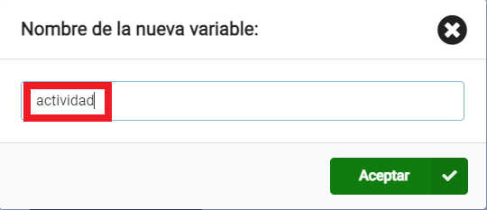

--- /task ---

Ahora verás que hay nuevos bloques disponibles. Estos bloques le permiten configurar, cambiar o usar el valor almacenado en la variable `actividad`{:class='microbitvariables'}.

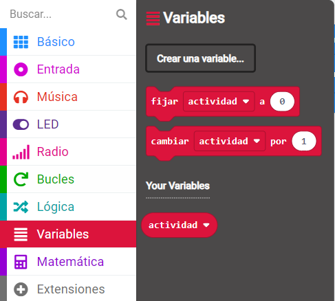

--- task ---

Arrastra el bloque `fijar`{:class='microbitvariables'} dentro del bloque `al iniciar`{:class='microbitbasic'}.

```microbit
let actividad = 0
```

--- /task ---

### ¿Qué pasatiempo se mostrará?

Cuando `actividad`{:class='microbitvariables'} se establece en `1`, debería aparecer el ícono de tu primer pasatiempo. Cuando `actividad`{:class='microbitvariables'} se establece en `2`, debería aparecer el icono del siguiente pasatiempo.

Usarás bloques `si... entonces` para hacerlo.

--- task ---

Abre el menú `lógica`{:class='microbitlogic'} y elige el bloque `si`{:class='microbitlogic'}.

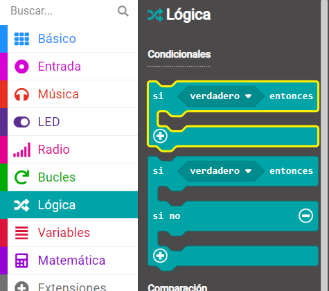

Arrastra el bloque `si`{:class='microbitlogic'} dentro del bloque de bucle `para siempre`{:class='microbitbasic'}. Colócalo **encima de** tu bloque `mostrar icono`{:class='microbitbasic'}.

```microbit
basic.forever(function () {
    if (true) {

    }
    basic.showIcon(IconNames.Ghost)
})
```

--- /task ---

--- task ---

Del menú `Lógica`{:class='microbitlogic'}, arrastra el bloque de comparación `0 = 0`{:class='microbitlogic'}.

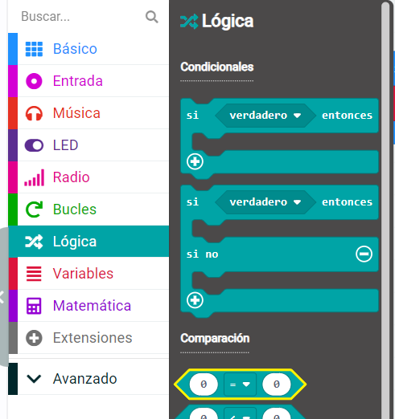

Colócalo dentro del bloque `verdadero` dentro del espacio `si`{:class='microbitlogic'}.

```microbit
basic.forever(function () {
    if (0 == 0) {

    }
    basic.showIcon(IconNames.Ghost)
})
```

--- /task ---

--- task ---

Vuelve al menú `Variables`{:class='microbitvariables'} y elige el bloque pequeño que dice `actividad`{:class='microbitvariables'}.

Arrastra este bloque al **primer** `0` en tu nuevo bloque de comparación.

Cambia el segundo `0` a `1`.

```microbit
basic.forever(function () {
    let actividad= 0
    if (actividad== 1) {

    }
    basic.showIcon(IconNames.Ghost)
})
```

--- /task ---

--- task ---

Arrastra tu bloque `mostrar icono`{:class='microbitbasic'} **dentro del** el bloque `si`{:class='microbitlogic'}.

```microbit
basic.forever(function () {
    let actividad = 0
    if (actividad == 1) {
        basic.showIcon(IconNames.Ghost)
    }
})
```

--- /task ---

--- task ---

**Prueba** tu programa:

Cuando hagas un cambio a un bloque de código, el simulador se reiniciará.

Seguramente has notado que nada apareció en los LEDs después de tu último cambio.

Encuentra de nuevo el bloque `establecer`{:class='microbitvariables'}. Pista: está dentro del bloque `al iniciar`{:class='microbitbasic'}.

**Cambia** la `0` a `1`.

**Vuelve a probar**:

Cuando el simulador se reinicie después de tu último cambio, el icono debería aparecer.

Asegúrate de **establecer el valor de la variable actividad nuevamente en `0`** listo para el siguiente paso.

--- /task ---

### Añade más pasatiempos

Para añadir más pasatiempos a tu programa, necesitarás añadir más condiciones a tu bloque `si`{:class='microbitlogic'}.

--- task ---

Haz clic en el símbolo `+` en la parte inferior del bloque `si`{: class='microbitlogic'}. Esto creará un bloque `si no`.


--- /task ---

--- task ---

Haz clic en el símbolo `+` debajo de la `si no`{:class='microbitlogic'}. Esto creará un `si no`{:class='microbitlogic'}. Haga esto una vez más para tener dos bloques `si no`{:class='microbitlogic'}.

--- /task ---

--- task ---

Ahora haz clic en el símbolo `-` junto a `si no`{:class='microbitlogic'} para eliminarlo.

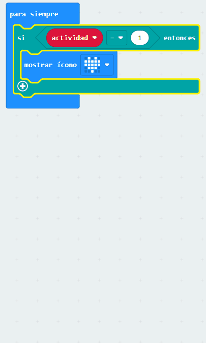

--- /task ---

--- task ---

Haz clic derecho en todo el bloque `=`{:class='microbitlogic'} en el primer bloque `if`{:class='microbitlogic'}.

Haz clic a la izquierda de la variable de actividad, o simplemente a la derecha del valor `0`para asegurarte de seleccionar todo el bloque.

Haz clic en **Duplicar** para hacer una copia.

Arrastre el bloque duplicado `=`{:class='microbitlogic'} al primer bloque `si no`{:class='microbitlogic'}. Luego cambia el número `1` a `2`.

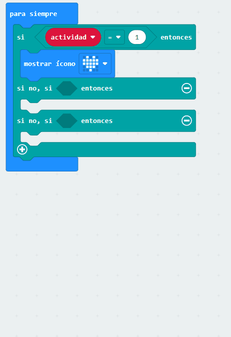

--- /task ---

--- task ---

Duplica el bloque `=`{:class='microbitlogic'} una vez más y arrástralo al segundo bloque `si no`{:class='microbitlogic'}. Luego cambia el número a `3`.

```microbit
basic.forever(function () {
    let actividad = 0
    if (actividad == 1) {
        basic.showIcon(IconNames.Ghost)
    } else if (actividad == 2) {

    } else if (actividad == 3) {

    }
})
```

--- /task ---

### Dale estilo a tus pasatiempos

--- task ---

**Elige** dos imágenes más para representar tus pasatiempos.

Puedes usar el bloque `mostrar ícono`{:class='microbitbasic'} o crear tu propio ícono usando el bloque `mostrar Leds`{:class='microbitbasic '}.

--- collapse ---

---
title: Usando el bloque mostrar leds
---

Arrastra el bloque `mostrar leds`{:class='microbitbasic'} del menú `Básico`{:class='microbitbasic'}, dentro de un bloque `si no, si`{:class='microbitlogic'}.

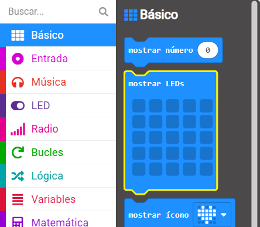

Puedes hacer clic en cada uno de los cuadrados para seleccionar los que quieras iluminar. Los cuadrados blancos se iluminarán en el micro:bit.

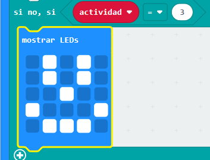

--- /collapse ---

--- /task ---

### Elige un pasatiempo al azar

**Configura** el micro:bit para elegir un pasatiempo aleatorio cuando lo agitas.

--- task ---

Arrastra el bloque `si agitado`{:class='microbitinput'} del menú `Entrada`{:class='microbitinput'}.

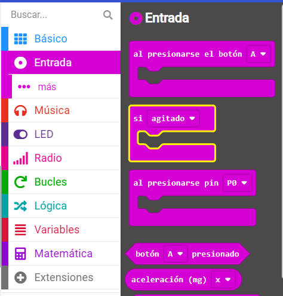

--- /task ---

--- task ---

Del menú `Variables`{:class='microbitvariables'}, arrastra el bloque `fijar`{:class='microbitvariables'} dentro del bloque `si agitado`{:class='microbitinput'}.

--- /task ---

--- task ---

Arrastra el bloque `escoge al azar`{:class='microbitmath'} del menú the `Matemática`{:class='microbitmath'} al `0` del bloque `fijar`{:class='microbitvariables'}.

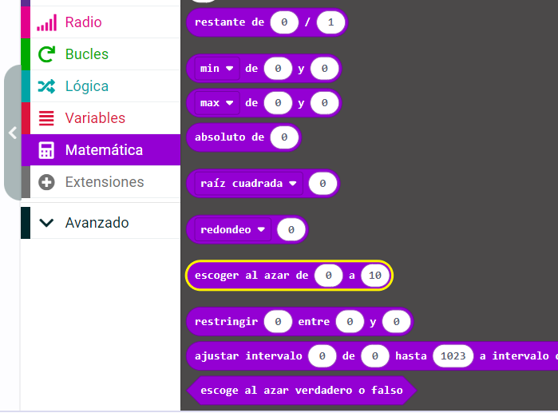

Cambia los números `0 a 10` a `1 a 3`.

```microbit
let actividad = 0
input.onGesture(Gesture.Shake, function () {
    actividad = randint(1, 3)
})
```

--- /task ---

### Borrar la pantalla

Usa el logotipo táctil (V2) o un botón (V1) para apagar los LEDs.

--- task ---

Arrastra el bloque `al pulsar el logotipo`{:class='microbitinput'} del menú `Entrada`{:class='microbitinput'}.

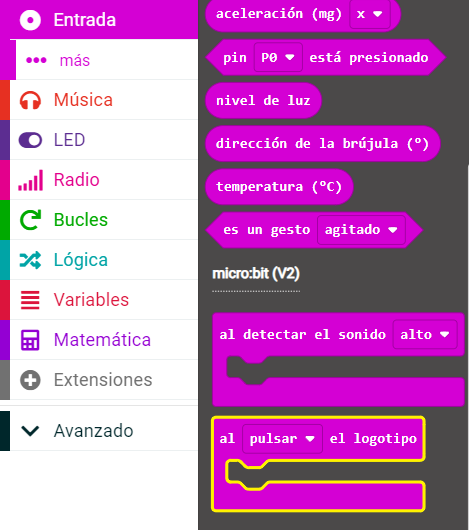

--- collapse ---

---
title: Usuarios de micro:bit V1
---

La entrada del logotipo sólo está disponible en el micro:bit V2.

Para el micro:bit V1, usa el bloque `al presionar botón`{:class='microbitinput'} del menú `Entrada`{:class='microbitinput'}.

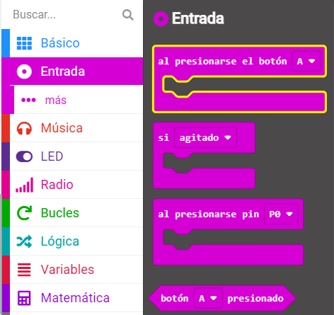

--- /collapse ---

--- /task ---

--- task ---

Arrastra el bloque `borrar la pantalla`{:class='microbitbasic'} del menú `Básico`{:class='microbitbasic'} y colócalo dentro del bloque `al presonar el logotipo`{:class='microbitinput'} (o el bloque `al presionar el botón`{:class='microbitinput'} para V1).

```microbit
input.onLogoEvent(TouchButtonEvent.Pressed, function () {
    basic.clearScreen()
})
```

--- /task ---

--- task ---

Ahora arrastra el bloque `fijar`{:class='microbitvariables'} del menú `Variables`{:class='microbitvariables'} y colócalo debajo del bloque `borrar la pantalla`{:class='microbitbasic'}.

```microbit
let actividad = 0
input.onLogoEvent(TouchButtonEvent.Pressed, function () {
    basic.clearScreen()
    actividad = 0
})
```

--- /task ---

--- task ---

**Prueba** tu programa:

**Haz clic** en el botón shake del simulador para elegir un pasatiempo al azar.

**Usa** el logotipo (o el botón A en el micro:bit V1) para asegurarte de que la pantalla se borre.

--- /task ---

--- task ---

¡Descarga tu código y pruébalo en un micro:bit físico!

[[[download-to-microbit]]]

Cuando hayas descargado tu programa a tu micro:bit, se ejecutará inmediatamente.

**Prueba**: Deberías ver un ícono aleatorio cada vez que agitas el micro:bit.

--- /task ---

[[[microbit-share]]]

### Proyecto terminado

Si quieres comprobar tu código puedes encontrar [el proyecto completo aquí](https://makecode.microbit.org/S47133-08356-20146-01355){:target="_blank"}.

### Mejora tu proyecto

Puedes mejorar tu proyecto para hacerlo más atractivo:

+ Agrega más pasatiempos para tener una gama más amplia para elegir.

Recuerda:
  + Añade un símbolo diferente para mostrar por cada actividad
  + Aumente el número de bloques `si no, si` para poder agregar más íconos
  + Aumenta el rango aleatorio a más de tres para que coincida con el número de pasatiempos que agregaste

***

Este proyecto fue traducido por voluntarios:

Laura Lurati

Gracias a los voluntarios, podemos dar a las personas de todo el mundo la oportunidad de aprender en su propio idioma. Puedes ayudarnos a llegar a más personas ofreciéndote como voluntario para traducir. Más información en [rpf.io/translate](https://rpf.io/translate).
