Le **micro:bit** est un petit ordinateur que tu peux utiliser pour interagir avec le monde qui t'entoure.

Ce projet t'aidera **à découvrir** ce que le **micro:bit** peut faire.

### Ce que tu vas faire

T'arrive-t-il de te demander quelle activité faire ensuite ? Tu peux utiliser le micro:bit pour t’aider à décider !

Dans ce projet, tu vas faire un sélecteur **aléatoire de loisirs**.

Tu vas :
+ Allumer le micro:bit et afficher des images
+ Utiliser des nombres aléatoires pour faire des choix
+ Utiliser des blocs `si`{:class='microbitlogic'} pour contrôler quelles images sont affichées
+ Utiliser le logo ou un bouton pour effacer l'affichage

--- no-print ---

### Joue ▶️

--- task ---

Que se passe-t-il si tu **secoues** le micro:bit ? Que se passe-t-il si tu cliques sur le **logo** ?

<div style="position:relative;height:100%;padding-bottom:125%;padding-top:0;overflow:hidden;">
<iframe style="position:absolute;top:0;left:0;width:100%;height:100%;" src="https://makecode.microbit.org/---run?id=S47133-08356-20146-01355" allowfullscreen="allowfullscreen" sandbox="allow-popups allow-forms allow-scripts allow-same-origin" frameborder="0"></iframe>
</div>

--- /task ---

--- /no-print ---

### Ouvrir MakeCode

Pour commencer à créer ton projet micro:bit, tu dois ouvrir l'éditeur MakeCode.

--- task ---

Ouvre l'éditeur MakeCode sur [makecode.microbit.org](https://makecode.microbit.org)

--- collapse ---

---
title: Version hors ligne de l'éditeur
---

Il y a aussi une version [téléchargeable de l'éditeur MakeCode](https://makecode.microbit.org/offline-app).

--- /collapse ---

--- /task ---

Une fois que l'éditeur est ouvert, tu devras créer un nouveau projet et donner un nom à ton projet.

--- task ---

Clique sur le bouton **Nouveau projet**.


--- /task ---

--- task ---

Donne à ton nouveau projet le nom `Sélecteur de loisirs` et clique sur **Créer**.

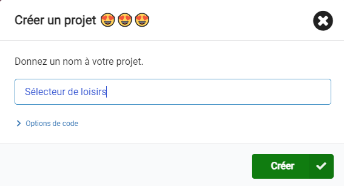

**Astuce :** pour faciliter la recherche de ton projet plus tard, donne-lui un nom utile qui se rapporte à l'activité que tu crées.

--- /task ---

### L'éditeur MakeCode

Créé par la Fondation micro:bit, l'éditeur **MakeCode** a tout ce dont tu as besoin pour commencer à coder sur micro:bit.

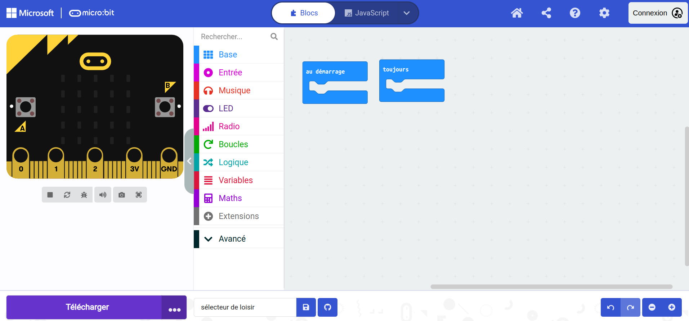

Sur le côté gauche, il y a un **simulateur**. Celui-ci contient un micro:bit virtuel que tu peux utiliser pour tester ton code !

Il a toutes les fonctionnalités et tous les boutons d'un micro:bit V2, y compris :
+ Écran LED
+ Haut-parleur
+ Microphone
+ Boutons de saisie
    + A
    + B
    + Logo

Au centre, il y a le panneau **blocs**, qui est codé en couleur et te permet d'accéder à divers blocs de code.

Sur le côté droit, il y a le panneau **de l'éditeur de code**où tu fais glisser et déposer des blocs pour créer ton programme.

Le panneau de l'éditeur MakeCode contient déjà deux blocs : `au démarrage`{:class='microbitbasic'} et `toujours`{:class='microbitbasic'}.

### Afficher l'icône

Tu utiliseras le bloc `toujours`{:class='microbitbasic'} pour voir comment fonctionnent les LEDs sur le simulateur.

--- task ---

Clique sur le menu bloc `Base`{:class='microbitbasic'} dans le panneau des blocs. Cela va l'étendre pour te montrer les blocs disponibles.

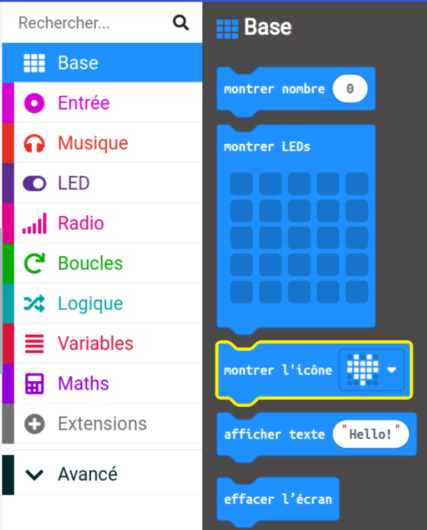

Fais glisser le bloc `montrer l'icône`{:class='microbitbasic'} et place-le **à l'intérieur du** bloc `toujours`{:class='microbitbasic'}. Cela devrait s’emboîter comme une pièce de puzzle.

```microbit
basic.forever(function () {
    basic.showIcon(IconNames.Heart)
})
```

--- /task ---

--- task ---

Clique sur la flèche vers le bas sur le bloc Montrer l'icône et choisis une icône.

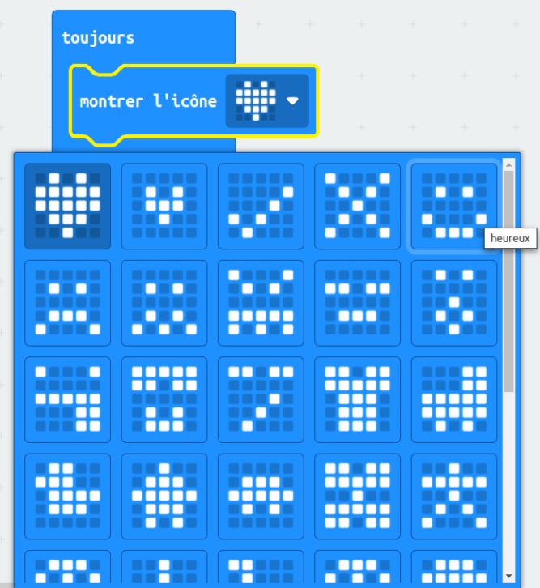


--- /task ---

--- task ---

**Test :** clique sur le bouton lancer du simulateur. L'écran LED devrait s'allumer en montrant l'icône que tu as choisie.

Dans cet exemple, nous avons choisi l'icône `X`.

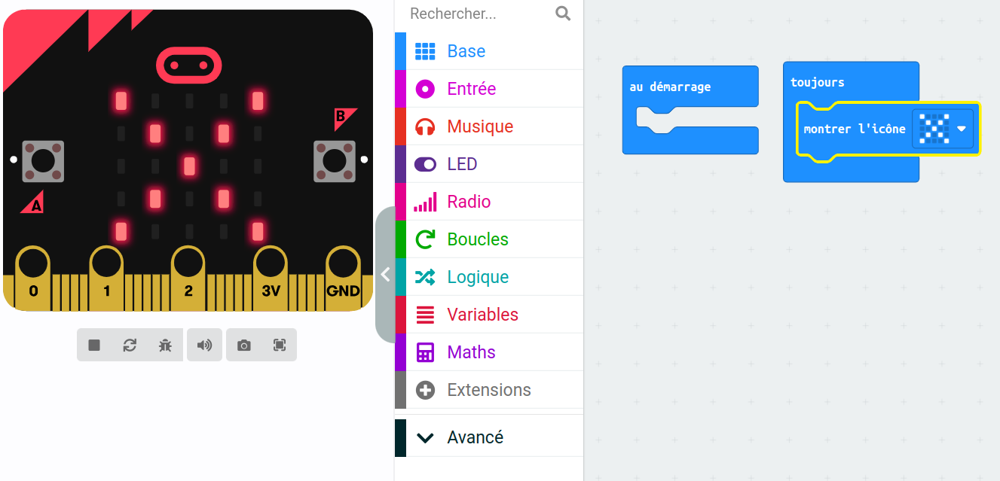

Bien joué ! Tu as fait faire quelque chose au micro:bit !

--- /task ---

### Choisir tes loisirs

--- task ---

Choisis trois loisirs ou activités que tu aimes faire pendant ton temps libre.

Voici quelques idées pour t'aider à démarrer :
+ 🎮 Jeu
+ 📚 Lecture
+ 🧁 Cuisine
+ 📺 Regarder la TV
+ 🚶‍♀️ Faire une promenade
+ 🏐 Pratiquer un sport
+ 🎨 Dessiner

--- /task ---

--- task ---

Change ton icône par celle qui représente ton premier loisir.

Nous avons choisi un fantôme Pac-Man pour représenter le jeu ! 👻

--- /task ---

### Créer une variable

Tu utiliseras trois icônes différentes pour représenter trois loisirs différents.

Chaque loisir sera lié à un nombre et tu créeras une variable de sorte que tu peux changer quel loisir est affiché.

--- task ---

Ouvre le menu `Variables`{:class='microbitvariables'} et clique sur **Créer une variable**.


--- /task ---

--- task ---

Nomme la nouvelle variable `activité`, puis clique sur le bouton **OK**.

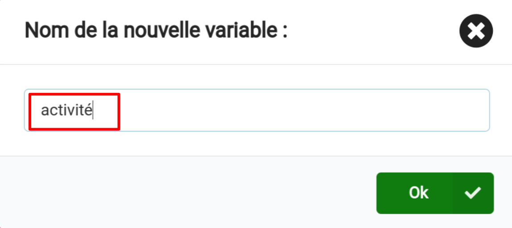

--- /task ---

Tu verras maintenant qu'il y a de nouveaux blocs disponibles. Ces blocs te permettent d'activer, de modifier ou d'utiliser la valeur stockée dans la variable `activité`{:class='microbitvariables'}.

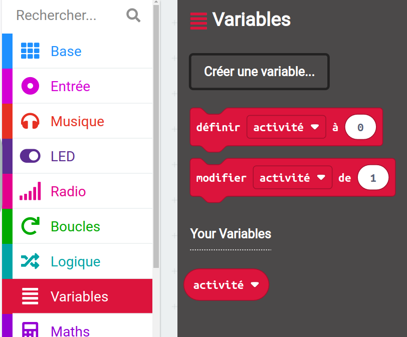

--- task ---

Fais glisser le bloc `définir`{:class='microbitvariables'} à l'intérieur du bloc `au démarrage`{:class='microbitbasic'}.

```microbit
let activité = 0
```

--- /task ---

### Quel loisir sera affiché ?

Lorsque `activité`{:class='microbitvariables'} est défini sur `1`, l'icône de ton premier loisir devrait s'afficher. Lorsque `avtivité`{:class='microbitvariables'} est défini sur `2`, l'icône du prochain loisir devrait s'afficher.

Tu utiliseras des blocs `si... alors` pour faire cela.

--- task ---

Ouvre le menu `Logique`{:class='microbitlogic'} et choisis le bloc `si`{:class='microbitlogic'}.

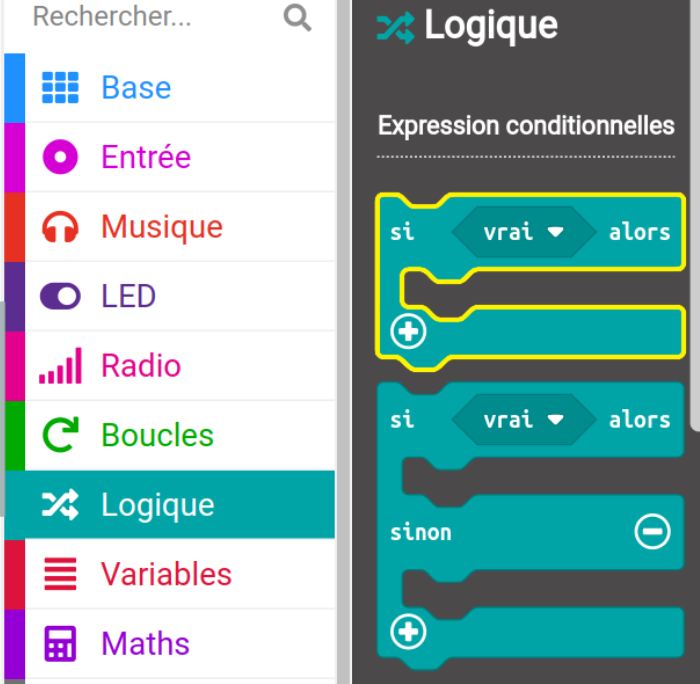

Fais glisser le bloc `si`{:class='microbitlogic'} à l'intérieur du bloc de boucle `toujours`{:class='microbitbasic'}. Place-le **au-dessus de** ton bloc `montrer l'icône`{:class='microbitbasic'}.

```microbit
basic.forever(function () {
    if (true) {

    }
    basic.showIcon(IconNames.Ghost)
})
```

--- /task ---

--- task ---

À partir du menu `Logique`{:class='microbitlogic'}, fais glisser le bloc de comparaison `0 = 0`{:class='microbitlogic'}.

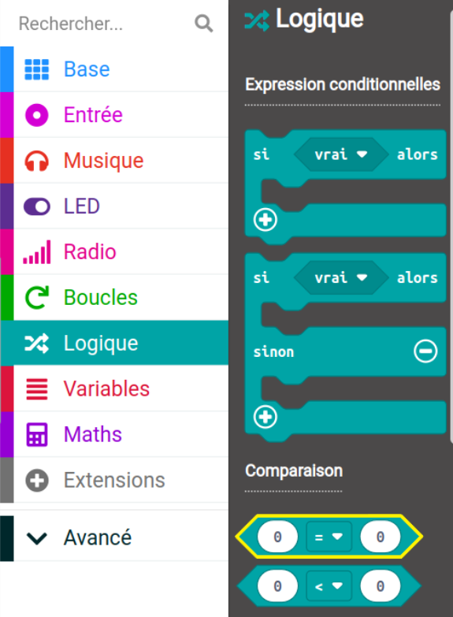

Place-le à l'intérieur de l'espace `vrai` dans le bloc `si`{:class='microbitlogic'}.

```microbit
basic.forever(function () {
    if (0 == 0) {

    }
    basic.showIcon(IconNames.Ghost)
})
```

--- /task ---

--- task ---

Retourne au menu `Variables`{:class='microbitvariables'} et choisis le petit bloc qui dit `activité`{:class='microbitvariables'}.

Fais glisser ce bloc vers le **premier** `0` dans ton nouveau bloc de comparaison.

Change le deuxième `0` en `1`.

```microbit
basic.forever(function () {
    let activité = 0
    if (activité == 1) {

    }
    basic.showIcon(IconNames.Ghost)
})
```

--- /task ---

--- task ---

Fais glisser ton bloc `montrer l'icône`{:class='microbitbasic'} **à l'intérieur du** bloc `si`{:class='microbitlogic'}.

```microbit
basic.forever(function () {
    let activité = 0
    if (activité == 1) {
        basic.showIcon(IconNames.Ghost)
    }
})
```

--- /task ---

--- task ---

**Teste** ton programme :

Lorsque tu fais un changement sur un bloc de code, le simulateur redémarre.

Tu as peut-être remarqué que rien n'est apparu sur les LEDs après ton dernier changement.

Recherche à nouveau ton bloc `définir`{:class='microbitvariables'}. Indice : il se trouve à l'intérieur du bloc `au démarrage`{:class='microbitbasic'}.

**Change** le `0` à `1`.

**Teste à nouveau** :

Lorsque le simulateur redémarre après ta dernière modification, l'icône devrait apparaître.

Assure-toi de **remettre la valeur de la variable d'activité à `0`**, prêt pour l'étape suivante.

--- /task ---

### Ajouter plus de loisirs

Pour ajouter plus d'options de loisirs à ton programme, tu devras ajouter plus de conditions à ton bloc `si`{:class='microbitlogic'}.

--- task ---

Clique sur le symbole `+` en bas du bloc `si`. Cela créera un bloc `sinon`.

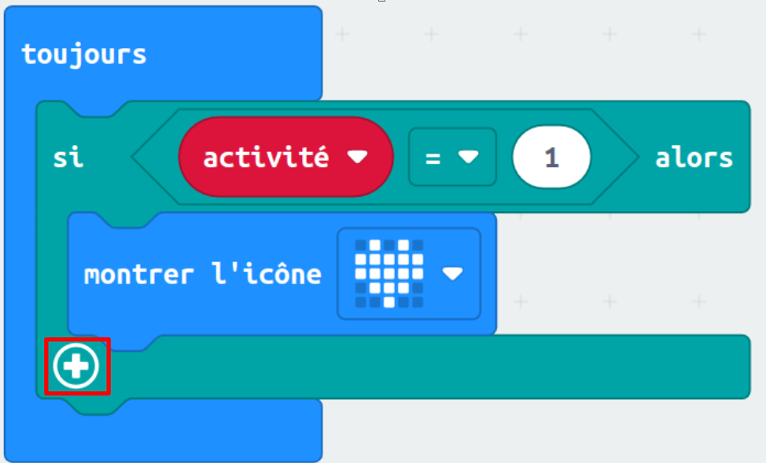

--- /task ---

--- task ---

Clique sur le symbole `+` sous le `sinon`{:class='microbitlogic'}. Cela créera un `sinon si`{:class='microbitlogic'}. Fais cela encore une fois pour avoir deux blocs `sinon si`{:class='microbitlogic'}.

--- /task ---

--- task ---

Maintenant, clique sur le symbole `-` à côté de `sinon`{:class='microbitlogic'} pour le supprimer.

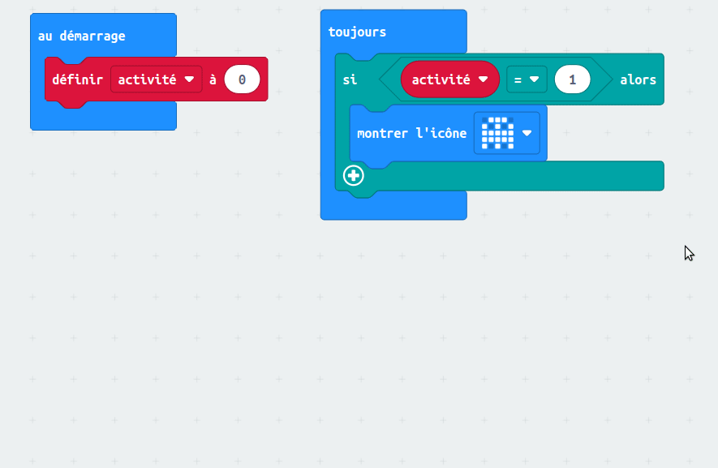

--- /task ---

--- task ---

Fais un clic droit sur le bloc `=`{:class='microbitlogic'} dans le premier bloc `si`{:class='microbitlogic'}.

Clique juste à gauche de la variable d'activité, ou juste à droite de la valeur `0`, pour t'assurer de sélectionner le bloc entier.

Clique sur **Dupliquer** pour faire une copie.

Fais glisser le bloc `=`{:class='microbitlogic'} dans le premier bloc `sinon si`{:class='microbitlogic'}. Puis change le nombre `1` en `2`.

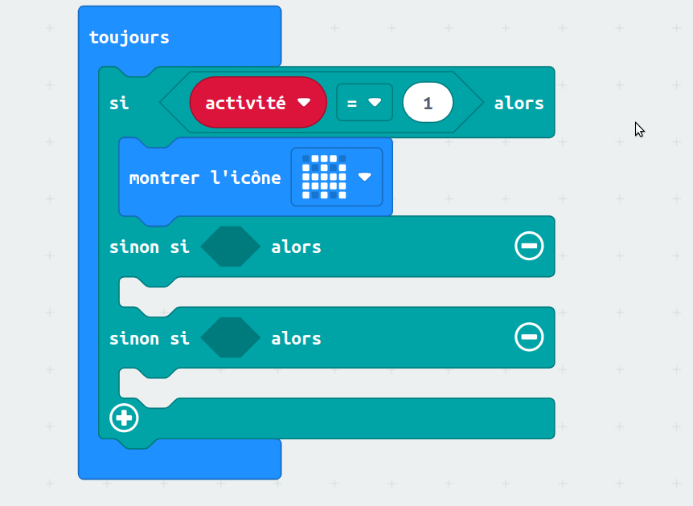

--- /task ---

--- task ---

Duplique le bloc `=`{:class='microbitlogic'} une fois de plus et fais-le glisser dans le deuxième bloc `sinon si`{:class='microbitlogic'}. Puis change le nombre en `3`.

```microbit
basic.forever(function () {
    let activité = 0
    if (activité == 1) {
        basic.showIcon(IconNames.Ghost)
    } else if (activité == 2) {

    } else if (activité == 3) {

    }
})
```

--- /task ---

### Donner du style à tes loisirs

--- task ---

**Choisis** deux images supplémentaires pour représenter tes loisirs.

Tu peux utiliser le bloc `montrer l'icône`{:class='microbitbasic'} ou créer ta propre icône en utilisant le bloc `montrer leds`{:class='microbitbasic'}.

--- collapse ---

---
title: Utiliser le bloc montrer leds
---

À partir du menu `Base`{:class='microbitbasic'}, fais glisser le bloc `montrer leds`{:class='microbitbasic'} à l'intérieur d'un bloc `sinon si`{:class='microbitlogic'}.


Tu peux cliquer sur chacun des carrés pour choisir ceux que tu veux allumer. Des carrés blancs seront allumés sur le micro:bit.

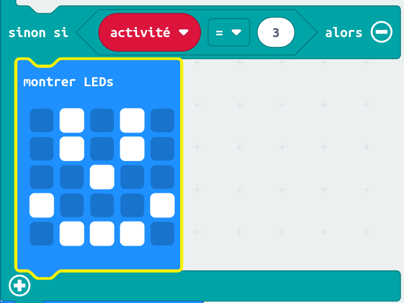

--- /collapse ---

--- /task ---

### Choisir un loisir au hasard

**Définis** le micro:bit pour choisir un loisir aléatoire quand tu le secoues.

--- task ---

Fais glisser le bloc `lorsque secouer`{:class='microbitinput'} du menu `Entrée`{:class='microbitinput'}.

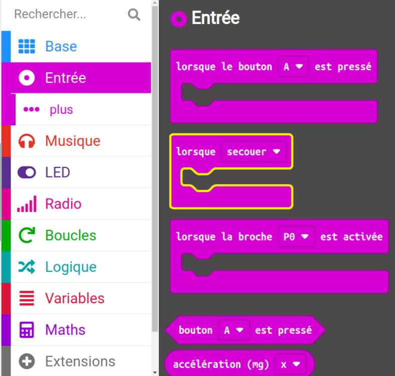

--- /task ---

--- task ---

À partir du menu `Variables`{:class='microbitvariables'}, fais glisser le bloc `définir`{:class='microbitvariables'} à l'intérieur du bloc `lorsque secouer`{:class='microbitinput'}.

--- /task ---

--- task ---

À partir du menu `Maths`{:class='microbitmath'}, fais glisser le bloc `choisir au hasard`{:class='microbitmath'} vers le bloc `0` du bloc `définir`{:class='microbitvariables'}.

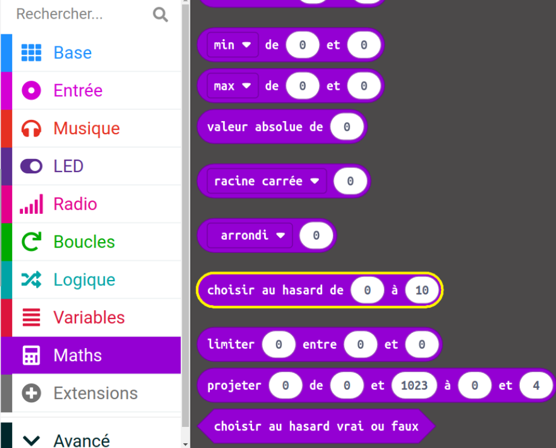

Change les nombres `0 à 10` à `1 à 3`.

```microbit
let activité = 0
input.onGesture(Gesture.Shake, function () {
    activité = randint(1, 3)
})
```

--- /task ---

### Effacer l'affichage

Utilise le logo tactile (V2) ou un bouton (V1) pour éteindre les LED.

--- task ---

Fais glisser le bloc `sur le logo appuyé`{:class='microbitinput'} depuis le menu `Entrée`{:class='microbitinput'}.

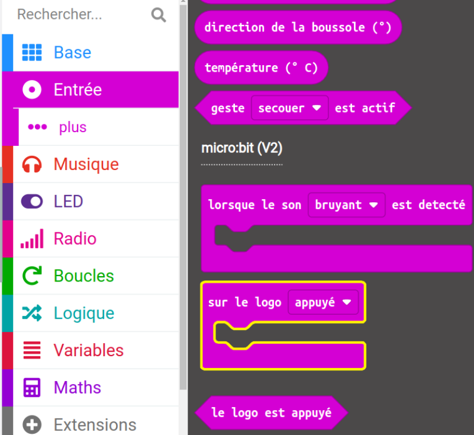

--- collapse ---

---
title: Utilisateurs micro:bit V1
---

L'entrée du logo n'est disponible que sur le micro:bit V2.

Pour le micro:bit V1, utilise le bloc `lorsque le bouton`{:class='microbitinput'} du menu `Entrée`{:class='microbitinput'}.

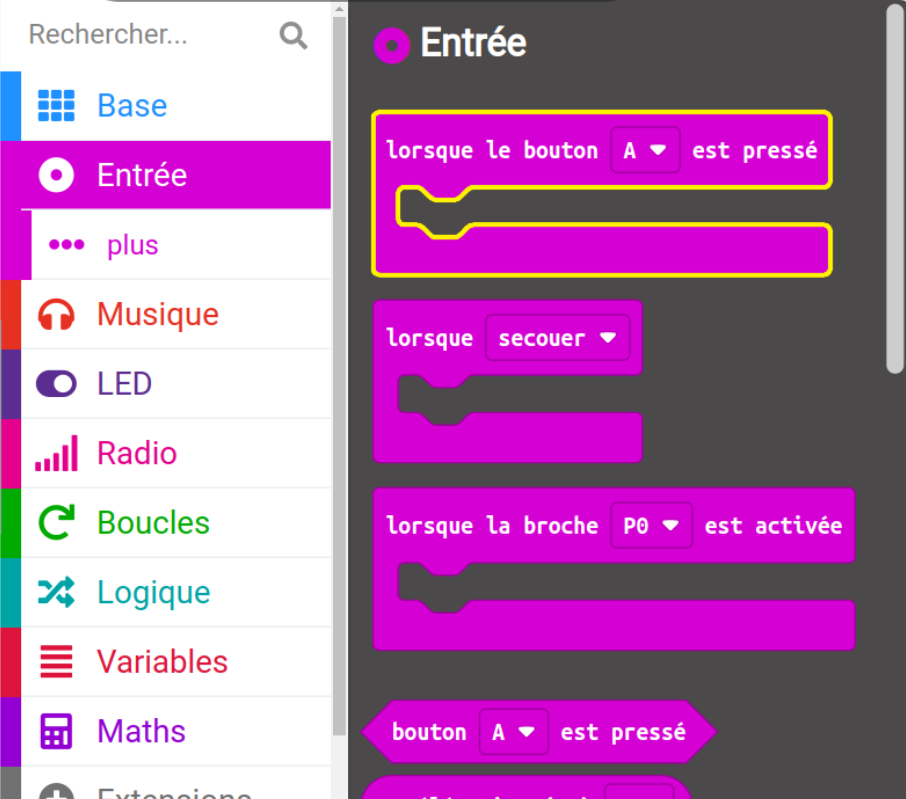

--- /collapse ---

--- /task ---

--- task ---

Fais glisser le bloc `effacer l'écran`{:class='microbitbasic'} du bloc `Base`{:class='microbitbasic'} et place-le à l'intérieur du bloc `sur le logo appuyé`{:class='microbitinput'} (ou le bloc `lorsque le bouton`{:class='microbitinput'} pour V1).

```microbit
input.onLogoEvent(TouchButtonEvent.Pressed, function () {
    basic.clearScreen()
})
```

--- /task ---

--- task ---

Maintenant, fais glisser le bloc `définir`{:class='microbitvariables'} à partir du bloc `Variables`{:class='microbitvariables'} et place-le sous le bloc `effacer l'écran`{:class='microbitbasic'}.

```microbit
let activité = 0
input.onLogoEvent(TouchButtonEvent.Pressed, function () {
    basic.clearScreen()
    activité = 0
})
```

--- /task ---

--- task ---

**Teste** ton programme :

**Clique sur** sur le bouton secouer sur le simulateur pour choisir aléatoirement un loisir.

**Utilise** le logo (ou le bouton A sur le micro:bit V1) pour t'assurer que l'écran est effacé.

--- /task ---

--- task ---

Télécharge ton code et teste-le sur un micro:bit physique !

[[[download-to-microbit]]]

Lorsque tu auras téléchargé ton programme sur ton micro:bit, il s'exécutera immédiatement.

**Test** : tu devrais voir une icône aléatoire à chaque fois que tu secoues le micro:bit.

--- /task ---

[[[microbit-share]]]

### Projet terminé

Si tu veux vérifier ton code, tu peux trouver [le projet terminé ici](https://makecode.microbit.org/S47133-08356-20146-01355){:target="_blank"}.

### Améliorer ton projet

Tu peux améliorer ton projet pour le rendre plus attrayant :

+ Ajoute plus de loisirs pour que tu puisses choisir parmi une gamme plus large.

N’oubliez pas :
  + Ajouter un symbole différent à afficher pour chaque activité
  + Augmenter le nombre de blocs `sinon si` afin de pouvoir ajouter plus d'icônes
  + Augmenter la plage aléatoire à plus de trois pour correspondre au nombre de loisirs ajoutés

***
Ce projet a été traduit par des bénévoles:

[name]

[name]

[name]

Grâce aux bénévoles, nous pouvons donner aux gens du monde entier la chance d'apprendre dans leur propre langue. Vous pouvez nous aider à atteindre plus de personnes en vous portant volontaire pour la traduction - plus d'informations sur [rpf.io/translate](https://rpf.io/translate).
