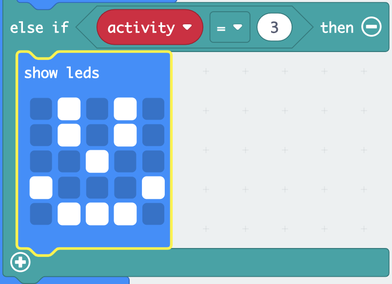

The **micro:bit** is a small computer that you can use to interact with the world around you.

This project will help you **discover** what the **micro:bit** can do.

### What you will make

Do you ever find yourself wondering what activity to do next? You can use the micro:bit to help you decide!

In this project, you will to make a **random hobby selector**.

You will:
+ Make the micro:bit light up and display images
+ Use random numbers to make choices
+ Use `if`{:class='microbitlogic'} blocks to control which images are displayed
+ Use the logo or a button to clear the display

--- no-print ---

### Play ▶️

--- task ---

What happens if you **shake** the micro:bit? What happens if you click the **logo**?

<div style="position:relative;height:100%;padding-bottom:125%;padding-top:0;overflow:hidden;">
<iframe style="position:absolute;top:0;left:0;width:100%;height:100%;" src="https://makecode.microbit.org/---run?id=S47133-08356-20146-01355" allowfullscreen="allowfullscreen" sandbox="allow-popups allow-forms allow-scripts allow-same-origin" frameborder="0"></iframe>
</div>

--- /task ---

--- /no-print ---

### Open MakeCode

To start creating your micro:bit project, you need to open the MakeCode editor.

--- task ---

Open the MakeCode editor at [makecode.microbit.org](https://makecode.microbit.org)

--- collapse ---

---
title: Offline version of the editor
---

There is also a [downloadable version of the MakeCode editor](https://makecode.microbit.org/offline-app).

--- /collapse ---

--- /task ---

Once the editor is open, you will need to create a new project and give your project a name.

--- task ---

Click on the **New Project** button.


--- /task ---

--- task ---

Give your new project the name `Hobby selector` and click **Create**.


**Tip:** To make it easier to find your project later, give it a helpful name that relates to the activity you’re creating.

--- /task ---

### The MakeCode editor

Created by the micro:bit Foundation, the **MakeCode editor** has everything you need to start coding on micro:bit.


On the left-hand side, there is a **simulator**. This contains a virtual micro:bit that you can use to test your code!

It has all the features and buttons found on a V2 micro:bit, including:
+ LED display
+ Speaker
+ Microphone
+ Input buttons
    + A
    + B
    + Logo

In the centre, there is the **blocks panel**, which is colour-coded and allows you to access the various code blocks.

On the right-hand side, there is the **code editor panel**, where you drag and drop blocks to create your program.

The MakeCode editor panel already contains two blocks: `on start`{:class='microbitbasic'} and `forever`{:class='microbitbasic'}.

### Show icon

You will use the `forever`{:class='microbitbasic'} block to see how the LEDs on the simulator work.

--- task ---

Click on the `Basic`{:class='microbitbasic'} block menu in the blocks panel. This will expand to show you the blocks available.


Drag the `show icon`{:class='microbitbasic'} block and drop it **inside** the `forever`{:class='microbitbasic'} block. It should fit in place like a puzzle piece.

```microbit
basic.forever(function () {
    basic.showIcon(IconNames.Heart)
})
```

--- /task ---

--- task ---

Click the down arrow on the show icon block and pick an icon.


--- /task ---

--- task ---

**Test:** Click the play button on the simulator. The LED display should light up, showing your chosen icon.

In this example, we have chosen the `X` icon.


Well done! You've made the micro:bit to do something!

--- /task ---

### Choose your hobbies

--- task ---

Choose three hobbies or activities you like to do in your spare time.

Here are some ideas to get you started:
+ 🎮 Gaming
+ 📚 Reading
+ 🧁 Baking
+ 📺 Watching TV
+ 🚶‍♀️ Going for a walk
+ 🏐 Playing a sport
+ 🎨 Drawing

--- /task ---

--- task ---

Change your icon to one that represents your first hobby.

We chose a Pac-Man ghost to represent gaming! 👻

--- /task ---

### Create a variable

You will use three different icons to represent three different hobbies.

Each hobby will be linked to a number and you will create a variable so you can change which hobby is displayed.

--- task ---

Open the `Variables`{:class='microbitvariables'} menu, and click **Make a variable**.


--- /task ---

--- task ---

Name the new variable `activity`, then click the **OK** button.


--- /task ---

You will now see that there are new blocks available. These blocks let you set, change, or use the value stored in the `activity`{:class='microbitvariables'} variable.


--- task ---

Drag the `set`{:class='microbitvariables'} block inside the `on start`{:class='microbitbasic'} block.

```microbit
let activity = 0
```

--- /task ---

### Which hobby will display?

When `activity`{:class='microbitvariables'} is set to `1`, the icon for your first hobby should display. When `activity`{:class='microbitvariables'} is set to `2`, the icon for the next hobby should display.

You will use `if... then` blocks to do this.

--- task ---

Open the `Logic`{:class='microbitlogic'} menu and choose the `if`{:class='microbitlogic'} block.


Drag the `if`{:class='microbitlogic'} block inside the `forever`{:class='microbitbasic'} loop block. Place it **above** your `show icon`{:class='microbitbasic'} block.

```microbit
basic.forever(function () {
    if (true) {

    }
    basic.showIcon(IconNames.Ghost)
})
```

--- /task ---

--- task ---

From the `Logic`{:class='microbitlogic'} menu, drag out the comparison block `0 = 0`{:class='microbitlogic'}.


Place it inside the `true` space within the `if`{:class='microbitlogic'} block.

```microbit
basic.forever(function () {
    if (0 == 0) {

    }
    basic.showIcon(IconNames.Ghost)
})
```

--- /task ---

--- task ---

Go back to the `Variables`{:class='microbitvariables'} menu and pick the small block that says `activity`{:class='microbitvariables'}.

Drag this block to the **first** `0` in your new comparison block.

Change the second `0` to `1`.

```microbit
basic.forever(function () {
    let activity = 0
    if (activity == 1) {

    }
    basic.showIcon(IconNames.Ghost)
})
```

--- /task ---

--- task ---

Drag your `show icon`{:class='microbitbasic'} block **inside** the `if`{:class='microbitlogic'} block.

```microbit
basic.forever(function () {
    let activity = 0
    if (activity == 1) {
        basic.showIcon(IconNames.Ghost)
    }
})
```

--- /task ---

--- task ---

**Test** your program:

When you make a change to a code block, the simulator will restart.

You may have noticed that nothing appeared on the LEDs after your last change.

Find your `set`{:class='microbitvariables'} block again. Hint: it's inside the `on start`{:class='microbitbasic'} block.

**Change** the `0` to `1`.

**Re-test**:

When the simulator restarts after your last change, the icon should appear.

Make sure you **set the value of the activity variable back to `0`** ready for the next step.

--- /task ---

### Add more hobbies

To add more hobby options to your program, you will need to add more conditions to your `if`{:class='microbitlogic'} block.

--- task ---

Click on the `+` symbol at the bottom of the `if` block. This will create an `else` block.


--- /task ---

--- task ---

Click on the `+` symbol below the `else`{:class='microbitlogic'}. This will create an `else if`{:class='microbitlogic'}. Do this one more time so you have two `else if`{:class='microbitlogic'} blocks.

--- /task ---

--- task ---

Now click on the `-` symbol next to the `else`{:class='microbitlogic'} to remove it.


--- /task ---

--- task ---

Right click on the whole `=`{:class='microbitlogic'} block in the first `if`{:class='microbitlogic'} block.

Click just to the left of the activity variable, or just to the right of the value `0`, to make sure you select the whole block.

Click **Duplicate** to make a copy.

Drag the duplicated `=`{:class='microbitlogic'} block into the first `else if`{:class='microbitlogic'} block. Then change the number `1` to a `2`.


--- /task ---

--- task ---

Duplicate the `=`{:class='microbitlogic'} block one more time and drag it into the second `else if`{:class='microbitlogic'} block. Then change the number to `3`.

```microbit
basic.forever(function () {
    let activity = 0
    if (activity == 1) {
        basic.showIcon(IconNames.Ghost)
    } else if (activity == 2) {

    } else if (activity == 3) {

    }
})
```

--- /task ---

### Style your hobbies

--- task ---

**Choose** two more images to represent your hobbies.

You can use the `show icon`{:class='microbitbasic'} block or create your own icon using the `show leds`{:class='microbitbasic'} block.

--- collapse ---

---
title: Using the show leds block
---

From the `Basic`{:class='microbitbasic'} menu, drag the `show leds`{:class='microbitbasic'} block inside an `else if`{:class='microbitlogic'} block.


You can click each of the squares to pick which ones you want to light up. White squares will be lit on the micro:bit.



--- /collapse ---

--- /task ---

### Choose a random hobby

**Set** the micro:bit to choose a random hobby when you shake it.

--- task ---

Drag the `on shake`{:class='microbitinput'} block from the `Input`{:class='microbitinput'} menu.


--- /task ---

--- task ---

From the `Variables`{:class='microbitvariables'} menu, drag the `set`{:class='microbitvariables'} block inside the `on shake`{:class='microbitinput'} block.

--- /task ---

--- task ---

From the `Math`{:class='microbitmath'} menu, drag the `pick random`{:class='microbitmath'} block to the `0` of the `set`{:class='microbitvariables'} block.


Change the numbers `0 to 10` to `1 to 3`.

```microbit
let activity = 0
input.onGesture(Gesture.Shake, function () {
    activity = randint(1, 3)
})
```

--- /task ---

### Clear the display

Use the touch-sensitive logo (V2) or a button (V1) to turn off the LEDs.

--- task ---

Drag the `on logo pressed`{:class='microbitinput'} block from the `Input`{:class='microbitinput'} menu.


--- collapse ---

---
title: V1 micro:bit users
---

The logo input is only available on the V2 micro:bit.

For the V1 micro:bit, use the `on button`{:class='microbitinput'} block from the `Input`{:class='microbitinput'} menu.


--- /collapse ---

--- /task ---

--- task ---

Drag the `clear screen`{:class='microbitbasic'} block from the `Basic`{:class='microbitbasic'} menu and place it inside the `on logo pressed`{:class='microbitinput'} block (or the `on button`{:class='microbitinput'} block for V1).

```microbit
input.onLogoEvent(TouchButtonEvent.Pressed, function () {
    basic.clearScreen()
})
```

--- /task ---

--- task ---

Now drag the `set`{:class='microbitvariables'} block from the `Variables`{:class='microbitvariables'} menu and place it below the `clear screen`{:class='microbitbasic'} block.

```microbit
let activity = 0
input.onLogoEvent(TouchButtonEvent.Pressed, function () {
    basic.clearScreen()
    activity = 0
})
```

--- /task ---

--- task ---

**Test** your program:

**Click** the shake button on the simulator to randomly choose a hobby.

**Use** the logo (or Button A on the V1 micro:bit) to make sure the screen clears.

--- /task ---

--- task ---

Download your code and test it on a physical micro:bit!

[[[download-to-microbit]]]

When you have downloaded your program to your micro:bit, it will run immediately.

**Test**: You should see a random icon each time you shake the micro:bit.

--- /task ---

[[[microbit-share]]]

### Completed project

If you want to check your code you can can find [the completed project here](https://makecode.microbit.org/S47133-08356-20146-01355).

### Upgrade your project

You can upgrade your project to make it more engaging:

+ Add more hobbies so you have a wider range to choose from.

Remember to:
  + Add a different symbol to display for each activity
  + Increase the number of `else if` blocks so you can add more icons
  + Increase the random range to more than three to match the number of added hobbies
