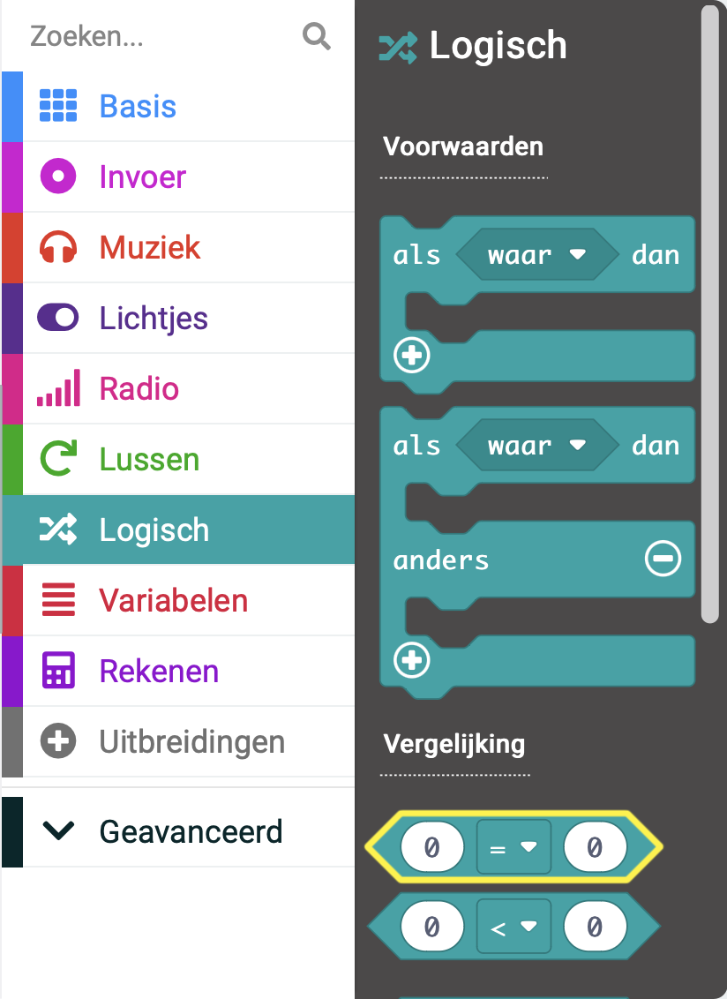

De **micro:bit** is een kleine computer die je kunt gebruiken om te communiceren met de wereld om je heen.

Dit project helpt je te **ontdekken** wat de **micro:bit** kan doen.

### Wat ga je maken

Verveel je je wel eens en weet je niet wat je wil gaan doen? Je kunt de micro:bit gebruiken om je te helpen bij het beslissen!

In dit project ga je een **hobby kiezer** maken.

Je gaat:
+ De micro:bit laten oplichten en afbeeldingen weergeven
+ Willekeurige getallen gebruiken om keuzes te maken
+ Gebruik `als`{:class='microbitlogic'} blokken om te bepalen welke afbeeldingen worden weergegeven
+ Het logo of een knop gebruiken om het scherm te wissen

--- no-print ---

### Afspelen ▶️

--- task ---

Wat gebeurt er als je de micro:bit **schudt**? Wat gebeurt er als je op het **logo** klikt?

<div style="position:relative;height:100%;padding-bottom:125%;padding-top:0;overflow:hidden;">
<iframe style="position:absolute;top:0;left:0;width:100%;height:100%;" src="https://makecode.microbit.org/---run?id=S47133-08356-20146-01355" allowfullscreen="allowfullscreen" sandbox="allow-popups allow-forms allow-scripts allow-same-origin" frameborder="0"></iframe>
</div>

--- /task ---

--- /no-print ---

### MakeCode openen

Om je micro:bit-project te maken, moet je eerst de MakeCode-editor openen.

--- task ---

Open de MakeCode editor op [makecode.microbit.org](https://makecode.microbit.org)

--- collapse ---

---
title: Offline versie van de editor
---

Er is ook een [downloadbare versie van de MakeCode editor](https://makecode.microbit.org/offline-app).

--- /collapse ---

--- /task ---

Zodra de editor is geopend, moet je een nieuw project aanmaken en je project een naam geven.

--- task ---

Klik op de knop **Nieuw Project**.


--- /task ---

--- task ---

Geef je nieuwe project de naam `Kies een hobby` en klik op **Aanmaken**.


**Tip:** Om het makkelijker te maken om je project later terug te vinden, geef het een logische naam die gerelateerd is aan de activiteit die je aan doen bent.

--- /task ---

### De MakeCode editor

De **MakeCode editor** - gemaakt door de micro:bit Foundation- bevat alles wat je nodig hebt om te beginnen met coderen op de micro:bit.


Aan de linkerkant is er een **simulator**. Dit bevat een virtuele micro:bit die je kunt gebruiken om je code te testen!

Het heeft alle functies en knoppen die je op een V2 micro:bit vindt, inclusief:
+ LED display
+ Luidspreker
+ Microfoon
+ Invoerknoppen
    + A
    + B
    + Logo

In het midden staat het **blokken paneel**, dat ingedeeld is per kleur en je toegang geeft tot de verschillende codeblokken.

Aan de rechterkant is er het **code editor paneel**, waar je blokken naar toe sleept om je programma te maken.

Het MakeCode editor paneel bevat al twee blokken: `bij opstarten`{:class='microbitbasic'} en `de hele tijd`{:class='microbitbasic'}.

### Toon pictogram

Je gaat het `de hele tijd` blok gebruiken om te zien hoe de LED's op de simulator werken.

--- task ---

Klik op het blokmenu `Basis`{:class='microbitbasic'} in het blokpaneel. Dit zal uitklappen om de beschikbare blokken te laten zien.


Sleep het `toon pictogram`{:class='microbitbasic'} blok en zet het neer **in** het `de hele tijd`{:class='microbitbasic'} blok. Het moet als een puzzelstuk op zijn plaats passen.

```microbit
basic.forever(function () {
    basic.showIcon(IconNames.Heart)
})
```

--- /task ---

--- task ---

Klik op de pijl omlaag op het Toon pictogram blok en kies een pictogram.


--- /task ---

--- task ---

**Test:** Klik op de afspeelknop van de simulator. Het LED-scherm moet oplichten, met het pictogram dat je gekozen hebt.

In dit voorbeeld hebben we het `X` pictogram gekozen.


Goed gedaan! Je hebt de micro:bit iets laten doen!

--- /task ---

### Kies je hobby's

--- task ---

Kies drie hobby's of activiteiten die je graag doet in je vrije tijd.

Hier zijn een paar ideeën om je op weg te helpen:
+ 🎮 Gamen
+ 📚 Lezen
+ 🧁 Bakken
+ 📺 Tv kijken
+ 🚶‍♀️ Wandelen
+ 🏐 Een sport beoefenen
+ 🎨 Tekenen

--- /task ---

--- task ---

Verander je pictogram in een die je eerste hobby vertegenwoordigt.

We hebben een Pac-Man spook gekozen voor gamen! 👻

--- /task ---

### Maak een variabele

Je gebruikt drie verschillende pictogrammen om drie verschillende hobby's weer te geven.

Elke hobby wordt aan een getal gekoppeld en je maakt een variabele zodat je kunt veranderen welke hobby wordt weergegeven.

--- task ---

Open het `Variabelen`{:class='microbitvariables'} menu en klik op **Maak een variabele**.


--- /task ---

--- task ---

Noem de nieuwe variabele `activiteit` en klik vervolgens op de knop **OK**.


--- /task ---

Je zult nu zien dat er nieuwe blokken beschikbaar zijn. Met deze blokken kun je de waarde die is opgeslagen in de variabele `activiteit`{:class='microbitvariables'} instellen, wijzigen of gebruiken.


--- task ---

Sleep het `stel in op`{:class='microbitvariables'} blok naar het bewerkingspaneel en plaats deze in het `bij opstart`{:class='microbitbasic'} blok.

```microbit
let activiteit = 0
```

--- /task ---

### Welke hobby wordt weergegeven?

Wanneer `activiteit`{:class='microbitvariables'} is ingesteld op `1`, moet het pictogram van je eerste hobby worden weergegeven. Wanneer `activiteit`{:class='microbitvariables'} is ingesteld op `2`, moet het pictogram van je eerste hobby worden weergegeven.

Je gebruikt hiervoor `als... dan` blokken.

--- task ---

Vanuit het `Logisch`{:class='microbitlogic'} menu, kies het `als`{:class='microbitlogic'} blok.


Sleep het `als`{:class='microbitlogic'} in het lus blok `de hele tijd`{:class='microbitbasic'}. Plaats het **boven** je `toon pictogram`{:class='microbitbasic'} blok.

```microbit
basic.forever(function () {
    if (true) {

    }
    basic.showIcon(IconNames.Ghost)
})
```

--- /task ---

--- task ---

Vanuit het menu `Logisch`{:class='microbitlogic'} sleep je het vergelijkingsblok `0 = 0`{:class='microbitlogic'}.



Plaats dit in het `waar`{:class='microbitlogic'} deel van het `als`{:class='microbitlogic'} blok.

```microbit
basic.forever(function () {
    if (0 == 0) {

    }
    basic.showIcon(IconNames.Ghost)
})
```

--- /task ---

--- task ---

Ga terug naar het `Variabelen`{:class='microbitvariables'} menu en kies het kleine blok dat `activiteit`{:class='microbitvariables'} heet.

Sleep dit blok naar de **eerste** `0` in je nieuwe vergelijkingsblok.

Verander de tweede `0` in `1`.

```microbit
basic.forever(function () {
    let activiteit = 0
    if (activiteit == 1) {
        
    }
    basic.showIcon(IconNames.Ghost)
})
```

--- /task ---

--- task ---

Sleep je `toon pictogram`{:class='microbitbasic'} blok **binnen** het `als`{:class='microbitlogic'} blok.

```microbit
basic.forever(function () {
    let activiteit = 0
    if (activiteit == 1) {
        basic.showIcon(IconNames.Ghost)
    }
})
```

--- /task ---

--- task ---

**Test:** Voer je programma uit:

Als je een wijziging in een codeblok aanbrengt, wordt de simulator opnieuw opgestart.

Het is je misschien opgevallen dat er na je laatste wijziging niets op de LED's verscheen.

Zoek opnieuw het `stel in op`{:class='microbitvariables'} blok. Tip: het bevindt zich in het `bij opstarten`{:class='microbitbasic'} blok.

**Verander** de `0` naar `1`.

**Test opnieuw**:

Wanneer de simulator na de laatste wijziging opnieuw opstart, zou het pictogram moeten verschijnen.

Zorg ervoor dat je **de waarde van de activiteitsvariabele weer op `0` zet**, zodat deze juist is ingesteld voor de volgende stap.

--- /task ---

### Voeg meer hobby's toe

Om meer hobbyopties aan je programma toe te voegen, moet je meer voorwaarden toevoegen aan je `als`{:class='microbitlogic'} blok.

--- task ---

Klik op het `+` -symbool onderaan het `als` -blok. Hierdoor wordt een `anders` blok gemaakt.


--- /task ---

--- task ---

Klik op het `+` symbool onder de `anders`{:class='microbitlogic'} sectie. Hierdoor wordt een `anders als`{:class='microbitlogic'} sectie aangemaakt. Doe dit nog een keer zodat je twee `als dan`{:class='microbitlogic'} blokken hebt.

--- /task ---

--- task ---

Klik nu op het `-` symbool naast de `anders`{:class='microbitlogic'} om het te verwijderen.


--- /task ---

--- task ---

Klik met de rechtermuisknop op het hele `=`{:class='microbitlogic'} blok in het eerste `als`{:class='microbitlogisch'} blok.

Klik net links van de activiteitsvariabele, of net rechts van de waarde `0`, om er zeker van te zijn dat je het hele blok selecteert.

Klik op **Dupliceren** om een kopie te maken.

Sleep het gedupliceerde `=`{:class='microbitlogic'} blok naar het eerste `als dan`{:class='microbitlogic'} blok. Verander vervolgens het getal `1` in een `2`.


--- /task ---

--- task ---

Dupliceer het `=`{:class='microbitlogic'} blok nog één keer en sleep het naar de tweede `als dan`{:class='microbitlogic'} blok. Verander vervolgens het nummer naar `3`.

```microbit
basic.forever(function () {
    let activiteit = 0
    if (activiteit == 1) {
        basic.showIcon(IconNames.Ghost)
    } else if (activiteit == 2) {

    } else if (activiteit == 3) {

    }
})
```

--- /task ---

### Geef je hobby's vorm

--- task ---

**Kies** nog twee afbeeldingen om je hobby's weer te geven.

Je kunt het `toon pictogram`{:class='microbitbasic'} blok gebruiken of je eigen pictogram maken met behulp van het `toon lichtjes`{:class='microbitbasic'} blok.

--- collapse ---

---
title: Gebruik het toon lichtjes blok
---

Vanuit het `Basis`{:class='microbitbasic'} menu sleep je het `Toon lichtjes`{:class='microbitbasic'} blok in een `als dan`{:class='microbitlogic'} blok.


Je kunt op elk van de vierkanten klikken om te kiezen welke je wilt laten oplichten. Witte vierkantjes worden verlicht op de micro:bit.


--- /collapse ---

--- /task ---

### Kies een willekeurige hobby

**Stel** de micro:bit in om een willekeurige hobby te kiezen wanneer je hem schudt.

--- task ---

Sleep het `bij schudden`{:class='microbitinput'} uit het menu `Invoer`{:class='microbitinput'}.


--- /task ---

--- task ---

Vanuit het `Variabelen`{:class='microbitvariables'} menu, sleep je het `stel in op`{:class='microbitvariables'} blok in het `bij schudden`{:class='microbitinput'} blok.

--- /task ---

--- task ---

Van het `Rekenen`{:class='microbitmath'} menu, sleep het `kies willekeurig`{:class='microbitmath'} blok naar het `0` blok van de `stel in op`{:class='microbitvariables'} blok.


Verander de getallen `0 tot 10` in `1 tot 3`.

```microbit
let activiteit = 0
input.onGesture(Gesture.Shake, function () {
    activiteit = randint(1, 3)
})
```

--- /task ---

### Het scherm wissen

Gebruik het logo (V2) of een knop (V1) om de LED's uit te schakelen.

--- task ---

Sleep het `bij logo ingedrukt`{:class='microbitinput'} blok uit het `Invoer`{:class='microbitinput'} menu.


--- collapse ---

---
title: V1 micro:bit-gebruikers
---

De logo-invoer is alleen beschikbaar op de V2 micro:bit.

Voor de V1 micro:bit, gebruik het `wanneer knop wordt ingedrukt`{:class='microbitinput'} blok van het `Invoer`{:class='microbitinput'} menu.


--- /collapse ---

--- /task ---

--- task ---

Sleep het `wis scherm`{:class='microbitbasic'} blok uit het `Basis`{:class='microbitbasic'} menu en plaats het in het `bij logo ingedrukt`{:class='microbitinput'} blok (of het `wanneer knop wordt ingedrukt`{:class='microbitinput'} blok voor V1).

```microbit
input.onLogoEvent(TouchButtonEvent.Pressed, function () {
    basic.clearScreen()
})
```

--- /task ---

--- task ---

Sleep nu het `stel in op`{:class='microbitvariables'} blok van het `Variabelen`{:class='microbitvariables'} menu en plaats het onder het `wis scherm`{:class='microbitbasic'} blok.

```microbit
let activiteit = 0
input.onLogoEvent(TouchButtonEvent.Pressed, function () {
    basic.clearScreen()
    activiteit = 0
})
```

--- /task ---

--- task ---

**Test:** Voer je programma uit:

**Klik** op de schudknop op de simulator om een willekeurige hobby te kiezen.

**Gebruik** het logo (of Knop A op de V1 micro:bit) om ervoor te zorgen dat het scherm wordt gewist.

--- /task ---

--- task ---

Download je code en test hem op een echte micro:bit!

[[[download-to-microbit]]]

Wanneer je jouw programma hebt gedownload naar jouw micro:bit, zal het onmiddellijk worden uitgevoerd.

**Test**: Je zou telkens een willekeurig pictogram moeten zien als je de micro:bit schudt.

--- /task ---

[[[microbit-share]]]

### Voltooid project

Als je je code wilt controleren, kun je [het voltooide project hier](https://makecode.microbit.org/S47133-08356-20146-01355) vinden.

### Verbeter je project

Je kunt je project verbeteren om het nog aantrekkelijker te maken:

+ Voeg meer hobby's toe, zodat je uit een groter assortiment kunt kiezen.

Vergeet niet om:
  + Een ander symbool toe te voegen om elke nieuwe activiteit
  + Verhoog het aantal `anders als` blokken zodat je meer iconen kunt toevoegen
  + Verhoog het willekeurige bereik tot meer dan drie zodat het overeen komt met het aantal toegevoegde hobby's
